# Introducing SwiftUI

- [Introducing SwiftUI](#introducing-swiftui)
  - [SwiftUI Essentials](#swiftui-essentials)
    - [Creating and Combining Views](#creating-and-combining-views)
      - [Create a New Project and Explore the Canvas](#create-a-new-project-and-explore-the-canvas)
      - [Customize the Text View](#customize-the-text-view)
      - [Combine Views Using Stacks](#combine-views-using-stacks)
      - [Create a Custom Image View](#create-a-custom-image-view)
      - [Use SwiftUI Views From Other Frameworks](#use-swiftui-views-from-other-frameworks)
      - [Compose the Detail View](#compose-the-detail-view)
    - [Building Lists and Navigation](#building-lists-and-navigation)
      - [Create a Landmark Model](#create-a-landmark-model)
      - [Create the Row View](#create-the-row-view)
      - [Customize the Row Preview](#customize-the-row-preview)
      - [Create the List of Landmarks](#create-the-list-of-landmarks)
      - [Make the List Dynamic](#make-the-list-dynamic)
      - [Set up Navigation Between List and Detail](#set-up-navigation-between-list-and-detail)
      - [Pass Data into Child View](#pass-data-into-child-view)
      - [Generate Previews Dynamically](#generate-previews-dynamically)
    - [Handling User Input](#handling-user-input)
      - [Mark the User's Favorite Landmarks](#mark-the-users-favorite-landmarks)
      - [Filter the List View](#filter-the-list-view)
      - [Add a Control to Toggle the State](#add-a-control-to-toggle-the-state)
      - [Use an Observable Object for Storage](#use-an-observable-object-for-storage)
      - [Adopt the Model Object in Your Views](#adopt-the-model-object-in-your-views)
      - [Create a Favorite Button for Each Landmark](#create-a-favorite-button-for-each-landmark)
  - [Drawing and Animation](#drawing-and-animation)
    - [Drawing Paths and Shapes](#drawing-paths-and-shapes)
      - [Create Drawing Data for a Badge View](#create-drawing-data-for-a-badge-view)
      - [Draw the Badge Background](#draw-the-badge-background)
      - [Draw the Badge Symbol](#draw-the-badge-symbol)
      - [Combine the Badge Foreground and Background](#combine-the-badge-foreground-and-background)
    - [Animating Views and Transitions](#animating-views-and-transitions)
      - [Add Hiking Data to the App](#add-hiking-data-to-the-app)
      - [Add Animations to Individual Views](#add-animations-to-individual-views)
      - [Animate the Effects of State Changes](#animate-the-effects-of-state-changes)
      - [Customize View Transitions](#customize-view-transitions)
      - [Compose Animations for Complex Effects](#compose-animations-for-complex-effects)
  - [App Design and Layout](#app-design-and-layout)
    - [Composing Complex Interfaces](#composing-complex-interfaces)
      - [Add a Category View](#add-a-category-view)
      - [Create a Category List](#create-a-category-list)
      - [Create a Category Row](#create-a-category-row)
      - [Complete the Category View](#complete-the-category-view)
      - [Add Navigation Between Sections](#add-navigation-between-sections)
    - [Working with UI Controls](#working-with-ui-controls)
      - [Display a User Profile](#display-a-user-profile)

## SwiftUI Essentials

- Learn how to use SwiftUI to compose rich views out of simple ones, set up data flow, and build the navigation while watching it unfold in Xcode's preview.

### Creating and Combining Views

- This tutorial guides you through building Landmarks - an app for discovering and sharing the places you love.
- You'll start by building the view that shows a landmark's details.
- To lay out the views, Landkmarks uses `VStack` and `HStack` to combine and layer the image and text view components.
- To add a map to the view, you 'll include a standard `MapKit` component.

- [Project files](https://docs-assets.developer.apple.com/published/9637262be4dfa3661d596e567d0c793f/CreatingAndCombiningViews.zip)

#### Create a New Project and Explore the Canvas

1. Open Xcode and either click "Create a new Xcode project" in Xcode's startup window, or choose File > New > Project.
2. In the template selector, select iOS as the platform, select the App template, and then click Next.
3. Enter "Landmarks" as the product name, select "SwiftUI" for the interface and "Swift" for the language, and click Next. Choose a location to save the project on your Mac.
4. In the Project navigator, select LandmarksApp.swift.
   1. An app that uses the SwiftUI app life cycle has a structure that conforms to the App protocol.
   2. The Structure's body property returns one or more scenes, which in turn provide content for display.
   3. The @main attribute identifies the app's entry point.
5. In the Project navigator, select ContentView.swift.
   1. By default, SwiftUI view files declare two structures.
   2. The first structure conforms to the View protocol and describes the view's content and layout.
   3. The second structure declares a preview for that view.
6. In the canvas, click Resume to display the preview.
   1. If the canvas isn't visible, select Editor > Canvas to show it.
7. Inside the body property, change "Hello, World!" to a greeting for yourself.
   1. As you change the code in a view's body property, the preview updates to reflect your changes.

#### Customize the Text View

1. Customize the text view using the inspector.
   1. In the preview, Command-click the greeting to bring up the structured editing popover, and choose "Show SwiftUI Inspector".
      1. The popover shows different attributes that you can customize, depending on the type of view you inspect.
      2. If it's not clickable, active Selectable on the left bottom
      - 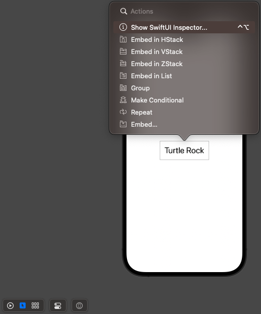
   2. Use the inspector to change the text to "Turtle Rock", the name of the first landmark you'll show in your app.
   3. Change the Font modifier to "Title".
      1. This applies the system font to the text so that it responds correctly to the user's preferred font sizes and settings.
      - 
2. To customize a SwiftUI view, you call methods called modifiers. Modifiers wrap a view to change its display or other properties. Each modifier returns a new view, so it's common to chain multiple modifiers, stacked vertically.
   1. Edit the code by hand to change the padding() modifier to the foreground Color(.green) modifier; this changes the text's color to green.
   - `Text("Turtle Rock").font(.title).foregroundColor(Color.green)`
3. Your code is always the source of truth for the view. When you use the inspector to change or remove a modifier, Xcode updates your code immediately to match.
   1. Open the inspector by Command-clicking on the Text declaration in the code editor, and then choose "Show SwiftUI Inspector" from the popover. Click the color pop-up menu and choose Inherited to change the text color to black again.
   2. Notice that Xcode updates your code automatically to reflect the change, removing the forgroundColor(.green) modifier.
   - 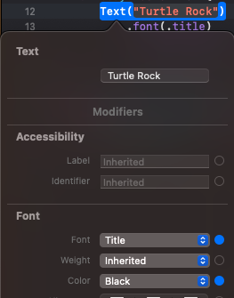

#### Combine Views Using Stacks

1. You can use Xcode's structured editing support to embed a view in a container view, open an inspector, or help with other useful changes.
   1. Command-click the text view's initializer to show the structured editing popover, and then choose "Embed in VStack".
      1. 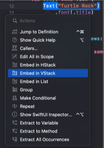
2. Next, you'll add a text view to the stack by dragging a Text view from the library.
   1. Open the library by clicking the plus button (+) at the top-right of the Xcode window, and then drag a Text view to the place in your code immediately below the "Turtle Rock" text view.
   2. Replace the Text view's placeholder text with "Joshua Tree National Park".
3. Customize the location to match the desired layout.
   1. Set the location's font to subheadline.
      1. `.font(.subheadline)`
   2. Edit the VStack initializer to align the views by their leading edges.
      1. By default, stack center their contents alogn their axis and provide context-appropriate spacing.
      2. `VStack(alignment: .leading) {`
4. Next, you'll add another text view to the right of the location, this for the park's state.

   1. In the canvas, Command-click "Joshua Tree National Park", and choose "Embed in HStack".
      1. 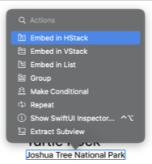
   2. Add a new text view after the location, change the placeholder text to "California", the park's state, and then set its font to subheadline.
      1. `Text("California").font(.subheadline)`
   3. To direct the layout to use the full width of the device, separate the park and the state by adding a `Spacer()` to the horizontal stack holding the two text views.
      1. A spacer expands to make its containing view use all of the space of its parent view, instead of having its size defined only by its contents.
   4. Finally, use the `padding()` modifier method to give the landmark's name and details a little more space.

   - ```swift
      struct ContentView: View {
          var body: some View {
              VStack {
                  VStack(alignment: .leading) {
                      Text("Turtle Rock")
                          .font(.title)
                          .foregroundColor(Color.black)
                      HStack {
                          Text("Joshua Tree National Park")
                              .font(.subheadline)
                          Spacer()
                          Text("California")
                              .font(.subheadline)
                      }
                  }
              }
              .padding()
          }
      }
     ```

   - 

#### Create a Custom Image View

1. Start by adding an image to the project's asset catalog.
   1. Find turtlerock@2x.jpg in the project files' Resources folder; drag it into the asset catalog's editor. Xcode creates a new image set for the image.
   2. 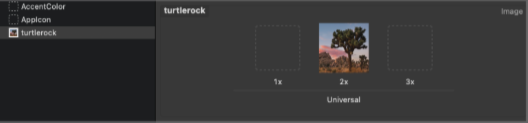
2. Next, you'll create a new SwiftUI view for your custom image view.
   1. Choose File > New > File to open the template selector again.
   2. In the User Interface section, select "SwiftUI View" and click Next. Name the file CircleImage.swift and click Create.
3. You're ready to insert the image and modify its display to match the desired design.

   1. Replace the: text view with the image of Turtle Rock by using the `Image(_:)` initializer, passing it the name of the image to display.
      1. You can check the name in the asset catalog's editor.
   2. Add a call to `clipShape(Circle())` to apply the circular clipping shape to the image.
      1. The Circle type is a shape that you can use as a mask, or as a view by giving the circle a stroke of fill.
      2. The shapes of `.clipShape()`:
         1. `Circle()`
         2. `Ellipse()`
         3. `Capsule()`
         4. `RoundedRectangle(cornerRadius: 25.0)`
         5. `Rectangle()`
   3. Create another circle with a gray stroke, and then add it as an overlay to give the image a border.
      1. `.overlay { Circle().stroke(.gray, lineWidth: 4) }`
   4. Next, add a shadow with a 7 point radius.
      1. `.shadow(radius:7)`
   5. Switch the border color to white.

   - ```swift
      import SwiftUI

      struct CircleImage: View {
          var body: some View {
              Image("turtlerock")
                  .clipShape(Circle())
                  .overlay {
                      Circle().stroke(.white, lineWidth: 4)
                  }
                  .shadow(radius: 7)
          }
      }

      struct CircleImage_Previews: PreviewProvider {
          static var previews: some View {
              CircleImage()
          }
      }
     ```

   - 

#### Use SwiftUI Views From Other Frameworks

- You'll create a map that centers on a given coordinate. You can use the Map view from MapKit to render the map.

1. To get started, you'll create a new custom view to manage your map.

   1. Choose File > New > File, select iOS as the platform, select the "SwiftUI View" template, and click Next.
      1. Name the new file MapView.swift and click Create.
   2. Add an import statement for MapKit, `import MapKit`.
      1. When you import SwiftUI and certain other frameworks in the same file, you gain access to SwiftUI-specific functionality provided by that framework.
   3. Create a private state variable that holds the region information for the map.

      1. You use the @State attribute to establish a source of truth for data in your app that you can modify from more than one view.
      2. SwiftUI manages the underlying storage and automatically updates views that depend on the value.

      - ```swift
          @State private var region = MKCoordinateRegion(
              center: CLLocationCoordinate2D(latitude: 34.011_286, longitude: -116.166_868),
              span: MKCoordinateSpan(latitudeDelta: 0.2, longitudeDelta: 0.2)
          )
        ```

   4. Replace the default Text view with a Map view that takes a binding to the region.
      1. By prefixing a state variable with $, you pass a binding, which is like a reference to the underlying value.
      2. When the user interacts with the map, the map updates the region value to match the part of the map that's currently visible in the user interface.

2. When previews are in static mode, they only fully render native SwiftUI views. For the Map view, you'll need to switch to a live preview to see it render.

   1. Click Live Preview to switch the preview to live mode. You might need to click Try Again or Resume above your preview.
      1. In a moment, you'll see a map centered on Turtle Rock.
      2. You can manipulate the map in live preview to zoom out a bit and see the surrounding area.

   - ```swift
       import SwiftUI
       import MapKit

       struct MapView: View {
           @State private var region = MKCoordinateRegion(
               center: CLLocationCoordinate2D(latitude:34.011, longitude: -116.166),
               span: MKCoordinateSpan(latitudeDelta: 0.2, longitudeDelta: 0.2)
           )
           var body: some View {
               Map(coordinateRegion: $region)
           }
       }

       struct MapView_Previews: PreviewProvider {
           static var previews: some View {
               MapView()
           }
       }
     ```

#### Compose the Detail View

- You new have all of the components you need - the name and place, a circular image, and a map for the location.
- With the tools you've used so far, combine your custom views to create the final design for the landmark detail view.
- 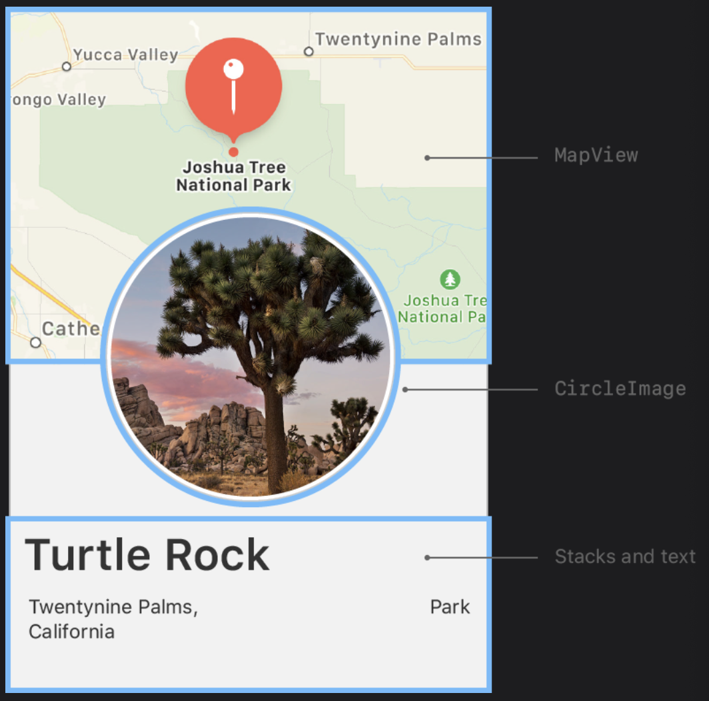

1. In the Project navigator, select the ContentView.swift file
2. Embed the VStack that holds the three text views in another VStack.
3. Add your custom MapView tot he top of the stack. Set the size of the Map View with `.frame(height:300)`.
4. Click Live Preview to see the rendered map in the composed view.
   1. You can continue editing the view while showing a Live Preview.
5. Add the CircleImage view to the stack.
6. To layer the image view on top of the map view, give the image an offset of -130 points vertically, `.offset(y:-130)`, and padding of -130 points from the bottom of the view, `.padding(.bottom, -130)`.
   1. These adjustments make room for the text by moving the image upwards.
7. Add a `Spacer()` at the bottom of the outer VStack to push the content to the top of the screen.
8. To allow the map content to extend to the top edge of the screen, add the `.ignoresSafeArea(edges: .top)` modifier to the map view.
   1. The modifier needs to put right after `MapView()`, so before `.frame()`.
      1. The height of map increases as much as the safe area.
   2. If the modifier locates after `.frame()`, the map will go up.
      1. The height of map keeps 300.
9. Add a `Divider()` and some additional descriptive text for the landmark.
10. Finally, move the subheadline font modifier from each Text view to the HStack containing them, and apply the secondary color to the subheadline text.
    1. When you apply a modifier to a layout view like a stack, SwiftUI applies the modifier to all the elements contained in the group.

- ContentView.swift

  - ```swift
      import SwiftUI

      struct ContentView: View {
          var body: some View {
              VStack {
                  MapView()
                      .ignoresSafeArea(edges: .top)
                      .frame(height:300)

                  CircleImage()
                      .offset(y:-130)
                      .padding(.bottom, -130)

                  VStack(alignment: .leading) {
                      Text("Turtle Rock")
                          .font(.title)
                          .foregroundColor(Color.black)
                      HStack {
                          Text("Joshua Tree National Park")
                          Spacer()
                          Text("California")
                      }
                      .font(.subheadline)
                      .foregroundColor(.secondary)

                      Divider()

                      Text("About Turtle Rock")
                          .font(.title2)
                      Text("Descriptive text goes here.")

                  }
                  .padding()

                  Spacer()
              }
          }
      }

      struct ContentView_Previews: PreviewProvider {
          static var previews: some View {
              ContentView()
          }
      }
    ```

---

### Building Lists and Navigation

- You'll create views that can show information about any landmark,
- and dynamically generate a scrolling list that a user can tap to see a detail view for a landmark.

- [Project files](https://docs-assets.developer.apple.com/published/58c23eda8649a103c25ce8f2b8d7547a/BuildingListsAndNavigation.zip)

#### Create a Landmark Model

- You'll create a model to store data that you can pass into your view.

1. Drag landmarkData.json in the downloaded files' Resources folder into your project's navigation pane;

   1. in the dialog that appears, select "Copy items if needed" and the Landmarks target, and then click Finish.
   2. You will use this sample data throughout the remainder of this tutorial, and for all that follow.

   - ```json
     [
       {
         "name": "Turtle Rock",
         "category": "Rivers",
         "city": "Twentynine Palms",
         "state": "California",
         "id": 1001,
         "isFeatured": true,
         "isFavorite": true,
         "park": "Joshua Tree National Park",
         "coordinates": {
           "longitude": -116.166868,
           "latitude": 34.011286
         },
         "description": "Suscipit inceptos est ...",
         "imageName": "turtlerock"
       },
       {
         "": ""
       }
     ]
     ```

2. Choose File > New > File to create a new `Swift file` in your project, and name it Landmark.swift.
3. Define a Landmark structure with a few properties matching names of some of the keys in the landmarkData.json data file.

   1. Adding `Codable` conformance makes it easier **to move data between the structure and a data file**.
   2. You'll reply on the `Decodable` component of the Codable protocol later in this section **to read data from file**.

   - ```swift
      import Foundation

      struct Landmark: Hashable, Codable {
          var id: Int
          var name: String
          var park: String
          var state: String
          var description: String
      }
     ```

4. Model the image associated with each landmark.
   1. Drag the JPG files from the downloaded files' Resources folder into your project's asset catalog.
      1. Xcode creates a new image set for each image.
      2. 
5. Add an `imageName` property to read the name of the image from the data, and a computed image property that loads an image from the asset catalog.

   1. You make the property `private` because users of the Landmarks structure care only about the image itself.

      - ```swift
          ...
          import SwiftUI

          struct Landmark: Hashable, Codable {
              ...

              private var imageName: String
              var image: Image {
                  Image(imageName)
              }
          }
        ```

6. Manage information about the landmark's location.

   1. Add a `coordinates` property to the structure using a `nested Coordinates type` that reflects the storage in the JSON data structure.

      1. You mark this property as `private` because you'll use it only to create a public computed property in the next step.

         - ```swift
             ...
             struct Landmark: Hashable, Codable {
                 ...

                 struct Coordinates: Hashable, Codable {
                     var latitude: Double
                     var longitude: Double
                 }
                 private var coordinates: Coordinates
             }
           ```

7. Compute a `locationCoordinate` property that's useful for interacting with the MapKit framework.

   - ```swift
       ...
       import CoreLocation

       struct Landmark: Hashable, Codable {
           ...
           var locationCoordinate: CLLocationCoordinate2D {
               CLLocationCoordinate2D(
                   latitude: coordinates.latitude,
                   longitude: coordinates.longitude
               )
           }
       }
     ```

8. Create an array initialized with landmarks from a file.

   1. Create a new `Swift file` in your project and name it ModelData.swift
   2. Create a `load(_:)` method that fetches JSON data with a given name from the app's main bundle.

      1. The load method relies on the return type's conformance to the Decodable protocol, which is one component of the Codable protocol.

      - ```swift
          import Foundation

          func load<T: Decodable>(_ filename: String) -> T {
              let data: Data

              guard let file = Bundle.main.url(forResource: filename, withExtension: nil) else {
                  fatalError("Couldn't find \(filename) in main bundle.")
              }

              do {
                  data = try Data(contentsOf: file)
              } catch {
                  fatalError("Couldn't load \(filename) from main bundle:\n\(error)")
              }

              do {
                  let decoder = JSONDecoder()
                  return try decoder.decode(T.self, from: data)
              } catch {
                  fatalError("Couldn't parse \(filename) as \(T.self):\n\(error)")
              }
          }
        ```

   3. Create an array of landmarks that you initialize from landmarkData.json

      - ```swift
          import Foundation

          var landmarks: [Landmark] = load("landmarkData.json")
          ...
        ```

9. Group related files together to make it easier to manage your growing project.

   1. Put ContentView.swift, CircleImage.swift, and MapView.swift into a Views group,
   2. landmarkData.json in a Resources group,
   3. and Landmark.swift and ModelData.swift into a Model group.
      1. You can create groups of existing items by selecting the items to add to the group,
      2. and then choosing File > New > Group from Selection in the Xcode menu.

   - 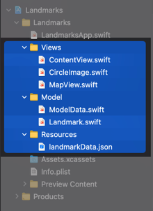

#### Create the Row View

- This row view stores information in a property for the landmark it displays, so that one view can display any landmark.
- Later, you'll combine multiple rows into a list of landmarks.
- 

1. Create a new SwiftUI view in the Views group named LandmarkRow.swift.
2. Add landmark as a stored property of LandmarkRow.

   1. When you add the landmark property, the preview stops working, because the LandmarkRow type needs a landmark instance during initialization.

   - ```swift
     struct LandmarkRow: View {
       var landmark: Landmark
       ...
     }
     ```

3. To fix the preview, you'll need to modify the preview provider.

   1. In the preview static property of LandmarkRow_Previews,
   2. add the landmark parameter to the LandmarkRow initializer,
   3. specifying the first element of the landmark array.

   - ```swift
      ...
      struct LandmarkRow_Previews: PreviewProvider {
          static var previews: some View {
              LandmarkRow(landmark: landmarks[0])
          }
      }
     ```

4. With the fixed, you can build the layout for the row.
   1. Embed the existing text view in an HStack.
   2. Modify the text view to use the landmark property's name.
   3. Complete the row by adding an image before the text view, and a spacer after it.

- ```swift
  import SwiftUI

  struct LandmarkRow: View {
      var landmark: Landmark
      var body: some View {
          HStack {
              landmark.image
                  .resizable()
                  .frame(width: 50, height: 50)
              Text(landmark.name)
              Spacer()
          }
      }
  }

  struct LandmarkRow_Previews: PreviewProvider {
      static var previews: some View {
          LandmarkRow(landmark: landmarks[0])
      }
  }
  ```

#### Customize the Row Preview

- A preview provider returns one or more views, with options to configure the size and device.

1. In LandmarkRow_Previews, update the landmark parameter to be the second element in the landmark array, `landmark[1]`.
   1. The preview immediately changes to show the second sample landmark instead of the first.
2. Use the previewLayout(\_:) modifier to set a size that approximates a row in a list.
3. You can use a Group to return multiple previews from a preview provider.

   1. Wrap the returned row in a Group, and add the first row back again.

      1. Group is a container for grouping view content. Xcode renders the group's child views as separate previews in the canvas.

      - ```swift
            struct LandmarkRow_Previews: PreviewProvider {
                static var previews: some View {
                    Group {
                        LandmarkRow(landmark: landmarks[0])
                            .previewLayout(.fixed(width: 300, height: 70))
                        LandmarkRow(landmark: landmarks[1])
                            .previewLayout(.fixed(width: 300, height: 70))
                    }
                }
            }
        ```

      - 

   2. To simplify the code, move the preview Layout(\_:) call to the outside of the group's child declarations.

      1. A view's children inherit the view's contextual settings, such as preview configurations.

      - ```swift
            struct LandmarkRow_Previews: PreviewProvider {
                static var previews: some View {
                    Group {
                        LandmarkRow(landmark: landmarks[0])
                        LandmarkRow(landmark: landmarks[1])
                    }
                    .previewLayout(.fixed(width: 300, height: 70))
                }
            }
        ```

4. The code you write in a preview provider only changes what Xcode displays in the canvas.

#### Create the List of Landmarks

- When you use SwiftUI's List type, you can display a platform-specific list of views.
- The elements of the list can be static, like the child views of the stacks you've created so far, or dynamically generated.
- You can even mix static and dynamically generated views.

1. Create a new SwiftUI view in the Views group named LandmarkList.swift.
2. Replace the default Text view with a List, and provide LandmarkRow instances with the first two landmarks as the list's children.

   1. The preview shows the two landmarks rendered in a list style that's appropriate for iOS.

   - ```swift
       import SwiftUI

       struct LandmarkList: View {
           var body: some View {
               List {
                   LandmarkRow(landmark: landmarks[0])
                   LandmarkRow(landmark: landmarks[1])
               }
           }
       }

       struct LandmarkList_Previews: PreviewProvider {
           static var previews: some View {
               LandmarkList()
           }
       }
     ```

   - 

#### Make the List Dynamic

- Instead of specifying a list's elements individually, you can generate rows directly from a collection.
- The list transforms each element in the collection into a child view by using the supplied closure.

1. Remove the two static landmark rows, and instead pass the model data's landmarks array to the List initializer.

   1. List work with identifiable data.
   2. You can make your data identifiable in one of two ways:
      1. by passing along with your data a key path to a property that uniquely identifies each element,
      2. or by making your data type conform to the Identifiable protocol.
   3. This creates one LandmarkRow for each element in the landmarks array.

   - ```swift
        ...
        struct LandmarkList: View {
            var body: some View {
                List(landmarks, id: \.id) { landmark in
                    LandmarkRow(landmark: landmark)
                }
            }
        }
        ...
     ```

   - 

2. Simplify the List code by adding Identifiable conformance to the Landmark type.
   1. Switch to Landmark.swift and declare conformance to the Identifiable protocol.
      1. The Landmark data already has the id property required by `Identifiable` protocol;
         1. `struct Landmark: Hashable, Codable, Identifiable {`
      2. you only need to add a property to decode it when reading the data.
   2. Switch back to LandmarkList.swift and remove the id parameter.
      1. `List(landmark) {`
      2. From now on, you'll be able to use collections of Landmark elements directly.

#### Set up Navigation Between List and Detail

- Add navigation capabilities to a list by embedding it in a NavigationView,
- and then nesting each row in a NavigationLink to set up a transition to a destination view.

1. Prepare a detail view using the content you created in the previous tutorial and update the main content view to display the list view instead.

   1. Create a new SwiftUI view named LandmarkDetail.swift.
   2. Copy the contents of the body property from ContentView into LandmarkDetail.

      - ```swift
            ...
            struct LandmarkDetail: View {
                var body: some View {
                    VStack {
                        MapView()
                            .ignoresSafeArea(edges: .top)
                            .frame(height:300)

                        CircleImage()
                            .offset(y:-130)
                            .padding(.bottom, -130)

                        VStack(alignment: .leading) {
                            Text("Turtle Rock")
                                .font(.title)
                                .foregroundColor(Color.black)
                            HStack {
                                Text("Joshua Tree National Park")
                                Spacer()
                                Text("California")
                            }
                            .font(.subheadline)
                            .foregroundColor(.secondary)

                            Divider()

                            Text("About Turtle Rock")
                                .font(.title2)
                            Text("Descriptive text goes here.")

                        }
                        .padding()

                        Spacer()
                    }
                }
            }
            ...
        ```

   3. Change ContentView to instead display LandmarkList.

      - ```swift
            ...
            struct ContentView: View {
                var body: some View {
                    LandmarkList()
                }
            }
            ...
        ```

2. Add navigation among your list and detail views.

   1. On `LandmarkList.swift`, embed the dynamically generated list of landmarks in a NavigationView.
   2. Call the navigationTitle(\_:) modifier method to set the title of the navigation bar when displaying the list.
   3. Inside the list's closure, wrap the returned row in a NavigationLink, specifying the LandmarkDetail view as the destination.

   - ```swift
        ...
        struct LandmarkList: View {
            var body: some View {
                NavigationView {
                    List(landmark) { landmark in
                        NavigationLink {
                            LandmarkDetail()
                        } label: {
                            LandmarkRow(landmark: landmark)
                        }
                        .navigationTitle("Landmarks")
                    }
                }
            }
        }
        ...
     ```

   - 

#### Pass Data into Child View

- Starting with the child views, you'll convert CircleImage, MapView, and then LandmarkDetail to display data that's passed in, rather than hard-coding each row.

1. In CircleImage.swift,

   1. add a stored image property to CircleImage.
      1. This is common pattern when building views using SwiftUI. Your custom views will often wrap and encapsulate a series of modifiers for a particular view.
   2. Update the preview provider to pass the image of Turtle Rock.
      1. Even though you've fixed the preview logic, the review fails to update because the build fails.
      2. The detail view, which instantiates a circle image, needs an input parameter as well.

   - ```swift
      import SwiftUI

      struct CircleImage: View {
          var image: Image

          var body: some View {
              image
                  .clipShape(Circle())
                  .overlay {
                      Circle().stroke(.white, lineWidth: 4)
                  }
                  .shadow(radius: 7)
          }
      }

      struct CircleImage_Previews: PreviewProvider {
          static var previews: some View {
              CircleImage(image: Image("turtlerock"))
          }
      }
     ```

2. In MapView.swift,

   1. add a coordinate property to MapView and update the preview provider to pass a fixed coordinate.
      1. This change also affects the build because the detail view has a map view that needs the new parameter.
   2. Add a method that updates the region based on a coordinate value.
   3. Add an onAppear view modifier to the map that triggers a calculation of the region based on the current coordinate.

   - ```swift
      import SwiftUI
      import MapKit

      struct MapView: View {
          var coordinate: CLLocationCoordinate2D
          @State private var region = MKCoordinateRegion()

          var body: some View {
              Map(coordinateRegion: $region)
                  .onAppear {
                      setRegion(coordinate)
                  }
          }

          private func setRegion(_ coordinate: CLLocationCoordinate2D) {
              region = MKCoordinateRegion(
                  center: coordinate,
                  span: MKCoordinateSpan(latitudeDelta: 0.2, longitudeDelta: 0.2)
              )
          }
      }

      struct MapView_Previews: PreviewProvider {
          static var previews: some View {
              MapView(coordinate: CLLocationCoordinate2D(latitude: 33.6444, longitude: -117.913))
          }
      }
     ```

3. In LandmarkDetail.swift,

   1. add a Landmark property to the LandmarkDetail type.

      - ```swift
          ...
          struct LandmarkDetail: View {
              var landmark: Landmark
              ...

          struct LandmarkDetail_Previews: PreviewProvider {
              static var previews: some View {
                  LandmarkDetail(landmark: landmark[0])
              }
          }
        ```

   2. pass the required data to your custom types.
   3. Change the container from a VStack to a ScrollView so the user can scroll through the descriptive content,
   4. and delete the Spacer, which you no longer need.
   5. Call the navigationTitle(\_:) modifier to give the navigation bar a title when showing the detail view,
   6. and the navigation BarTitleDisplayMode(\_:) modifier to make the title appear inline.
      1. The navigation changes only have an effect when the view is part of a navigation stack.

   - ```swift
      ...
      var body: some View {
          ScrollView {
              MapView(coordinate: landmark.locationCoordinate)
                  ...

              CircleImage(image: landmark.image)
                  ...

              VStack(alignment: .leading) {
                  Text(landmark.name)
                      ..
                  HStack {
                      Text(landmark.park)
                      Spacer()
                      Text(landmark.state)
                  }
                  ..

                  Divider()

                  Text("About \(landmark.name)")
                      .font(.title2)
                  Text(landmark.description)

              }
              .padding()
          }
          .navigationTitle(landmark.name)
          .navigationBarTitleDisplayMode(.inline)
      }
      ...
     ```

4. In LandmarkList.swift, pass the current landmark to the destination Landmark Detail.

   - ```swift
      ...
                      NavigationLink {
                        LandmarkDetail(landmark: landmark)
                        ...
     ```

   - 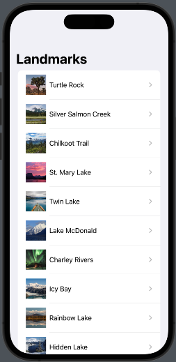 

#### Generate Previews Dynamically

- You'll add code to the LandmarkList_Previews preview provider to render previews of the list view at different device sizes.
- By default, previews render at the size of the device in the active scheme.
- You can change the preview device by calling the previewDevice(\_:) modifier mothod.

1. Start by changing the current list preview to render at the size of an iPhone SE on LandmarkList.swift.

   1. You can provide the name of any device as it appears in Xcode's scheme menu.

   - ```swift
      ...
      struct LandmarkList_Previews: PreviewProvider {
          static var previews: some View {
              LandmarkList()
                  .previewDevice(PreviewDevice(rawValue: "iPhone SE (3rd generation)"))
          }
      }
     ```

2. Within the list preview, embed the Landmark List in a ForEach instance, using an array of device names as the data.
   1. ForEach operates on collections the same way as the list, which means you can use it anywhere you can use a child view,
   2. such as in stacks, lists, groups, and more.
   3. When the elements of your data are simply value types - like the strings you're using here - you can use \.self as key path to the identifier.
3. Use the previewDisplayName(\_:) modifier to add the device names as labels for the previews.
4. You can experiment with different devices to compare the renderings of your views, all from the canvas.

   - ```swift
      static var previews: some View {
          ForEach(["iPhone SE (3rd generation)", "iPhone 14 Pro Max"], id: \.self) { deviceName in
              LandmarkList()
                  .previewDevice(PreviewDevice(rawValue: deviceName))
                  .previewDisplayName(deviceName)
          }
      }
     ```

   - 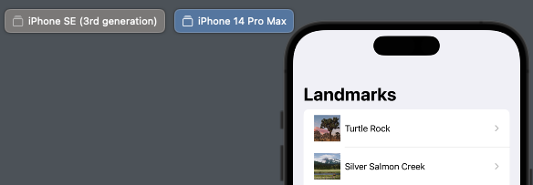

### Handling User Input

- In the Landmarks app, a user can flag their favorite places, and filter the list to show just their favorites.
- To create this feature, you'll start by adding a switch to the list so users can focus on just their favorites,
- and then you'll add a star-shaped button that a user taps to flag a landmark as a favorite.

#### Mark the User's Favorite Landmarks

1. Select Landmark.swift in the Project navigator.
2. Add an isFavorite property, `var isFavorite: Bool`, to the Landmark structure.
   1. The landmarkData.json file has a key with this name for each landmark.
   2. Because Landmark conforms to Codable, you can read the value associated with the key
   3. by creating a new property with the same name as the key.
3. Select LandmarkRow.swift in the Project navigator.
4. After the spacer, add a star image inside an if statement to test whether the current landmark is a favorite.
   1. In SwiftUI blocks, you use if statements to conditionally include views.
5. Because system images are vector based, you can change their color with the foregroundColor(\_:) modifier.

   1. The star is present whenever a landmark's isFavorite property is true.

   - ```swift
      if landmark.isFavorite {
          Image(systemName: "star.fill")
              .foregroundColor(.yellow)
      }
     ```

   - 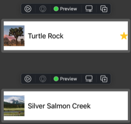

#### Filter the List View

- To Filtering, you'll need to add a bit of state to the landmarkList type.
- State is a value, or set of values, that can change over time, and that affects a view's behavior, content, or layout.
- You use a property with the `@State` attribute to add state to a view.

1. Select LandmarkList.swift and revert the preview to show only a single version of the list.
2. Add a `@State` property called showFavoritesOnly with its initial value set to `false`, `@State private var showFavoritesOnly = false`
   1. Because you use the state properties to hold information that's specific a view and its subviews, you always create state as private.
3. Compute a filtered version of the landmarks list by checking the showFavoritesOnly property and each landmark.isFavorite value.

   - ```swift
      struct LandmarkList: View {
          ...
          var filteredLandmarks: [Landmark] {
              landmarks.filter { landmark in
                  (!showFavoritesOnly || landmark.isFavorite)
              }
          }
          ...
     ```

4. Use the filtered version of the list of landmarks in the List.

   - ```swift
          var body: some View {
              NavigationView {
                  List(filteredLandmarks) { landmark in
                   ...
     ```

   - 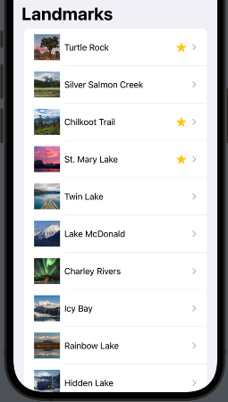

5. Change the initial value of showFavoritesOnly to `true` to see how the list reacts.

   - 

#### Add a Control to Toggle the State

- To give the user control over the list's filter, you need to add a control that can alter the value of `showFavoritesOnly`.
- You do this by passing a binding to a toggle control.

1. Create a nested `ForEach` group to transform the landmarks into rows.
   1. **To combine static and dynamic views in a list**, or **to combine two or more different groups of dynamic views**, **use the `ForEach` type** instead of passing your collection of data to List.
2. Add a `Toggle` view as the first child of the List view, passing a binding to `showFavoritesOnly`.
   1. You use the `$` prefix to access a binding to a state variable, or one of its properties.
3. Before moving on, return the default value of `showFavoritesOnly` to `false`.

   - ```swift
      import SwiftUI

      struct LandmarkList: View {
          @State private var showFavoritesOnly = false

          var filteredLandmarks: [Landmark] {
              landmark.filter { landmark in
                  (!showFavoritesOnly || landmark.isFavorite)
              }
          }
          var body: some View {
              NavigationView {
                  List {
                      Toggle(isOn: $showFavoritesOnly) {
                          Text("Favorites Only")
                      }
                      ForEach(filteredLandmarks) { landmark in
                          NavigationLink {
                              LandmarkDetail(landmark: landmark)
                          } label: {
                              LandmarkRow(landmark: landmark)
                          }
                          .navigationTitle("Landmarks")
                      }
                  }
              }
          }
      }
     ```

   - 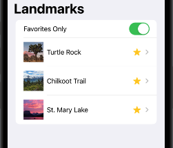

#### Use an Observable Object for Storage

- To prepare for the user to control which particular landmarks are favorites, you'll first store the landmark data in an observable object.
- An observable object is a custom object for your data that can be bound to a view from storage in SwiftUI's environment.
- SwiftUI watches for any changes to observable objects that could affect a view, and displays the correct version of the view after a change.

1. In the project's navigation pane, select ModelData.swift.
2. Declare a new model type that conforms to the ObservableObject protocol, `final class ModelData: ObservableObject` from the `Combine` framework.
   1. SwiftUI subscribes to your observable object, and updates any views that need refreshing when the data changes.
3. Move the landmarks array into the model.
4. An observable object needs to publish any changes to its data, so that its subscribers can pick up the changes.

   1. Add the `@Published` attribute to the landmarks array.

   - ```swift
      ...
      import Combine

      final class ModelData: ObservableObject {
          @Published var landmark: [Landmark] = load("landmarkData.json")
      }

      func load<T: Decodable>(_ filename: String) -> T {
        ...
     ```

#### Adopt the Model Object in Your Views

1. In `LandmarkList.swift`, add an `@EnvironmentObject` property declaration to the view, and an environment Object(\_:) modifier to the preview.
   1. The modelData property gets its value automatically, as long as the environment Object(\_:) modifier has been applied to a parent.
2. Use modelData.landmarks as the data when filtering landmarks.

   - ```swift
      import SwiftUI
      struct LandmarkList: View {
          @EnvironmentObject var modelData: ModelData
          @State private var showFavoritesOnly = false

          var filteredLandmarks: [Landmark] {
              modelData.landmarks.filter { landmark in
              ...
      struct LandmarkList_Previews: PreviewProvider {
          static var previews: some View {
              LandmarkList()
                  .environmentObject(ModelData())
                  ...
     ```

3. Update the `LandmarkDetail` preview to work with the ModelData object in the environment.

   - ```swift
      static var previews: some View {
          LandmarkDetail(landmark: ModelData().landmarks[0])
      }
     ```

4. Update the `LandmarkRow` preview to work with the ModelData object.

   - ```swift
      struct LandmarkRow_Previews: PreviewProvider {
          static var landmarks = ModelData().landmarks
          ...
     ```

5. Update the `ContentView` preview to add the model object to the environment, which makes the object available to any subview.

   1. A preview fails if any subview requires a model object in the environment, but the view you are previewing doesn't have the environment Object(\_:) modifier.

   - ```swift
      static var previews: some View {
          ContentView().environmentObject(ModelData())
     ```

6. Update the app instance to put the model object in the environment when you run the app in the simulator or on a device.

   1. Update the `LandmarksApp` to create a model instance and supply it to ContentView using the environmentObject(\_:) modifier.

      1. Use the `@StateObject` attribute to initialize a model object for a given property only once during the life time of the app.
      2. This is true when you use the attribute in an app instance, as shown here, as well as you use it in a view.

      - ```swift
          struct LandmarksApp: App {
              @StateObject private var modelData = ModelData()
              var body: some Scene {
                  WindowGroup {
                      ContentView()
                          .environmentObject(modelData)
                  }
              }
          }
        ```

#### Create a Favorite Button for Each Landmark

1. Create a reusable Favorite Button.

   1. Create a SwiftUI view called FavoriteButton.swift
   2. Add an isSet binding that indicates the button's current state, and provide a constant value for the preview.
   3. Create a Button with an action that toggles the isSet state, and that changes its appearance based on the state.
      1. The title string that you provide for the button's label doesn't appear in the UI when you use the iconOnly label style,
      2. but VoiceOver uses it to improve accessibility.

   - ```swift
      import SwiftUI

      struct FavoriteButton: View {
          @Binding var isSet: Bool

          var body: some View {
              Button {
                  isSet.toggle()
              } label: {
                  Label("Toggle Favorite", systemImage: isSet ? "star.fill" : "star")
                      .labelStyle(.iconOnly)
                      .foregroundColor(isSet ? .yellow : .gray)
              }
          }
      }

      struct FavoriteButton_Previews: PreviewProvider {
          static var previews: some View {
              FavoriteButton(isSet: .constant(true))
          }
      }
     ```

2. As your project grows, it's a good idea to add hierarchy. Before moving on, create a few more groups.

   1. Collect the general purpose CircleImage.swift, MapView.swift, and FavoriteButton.swift, into a `Helpers` group,
   2. and the landmark views into a `Landmarks` group.

   - 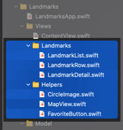

3. Add the FavoriteButton to the detail view, binding the button's isSet property to the isFavorite property of a given landmark.

   1. Switch to `LandmarkDetail.swift`, and compute the index of the input landmark by comparing it with the model data.
      1. To support this, you also need access to the environment's model data.
      2. Force-unwrap using '!' to abort execution if the optional value contains 'nil'.
   2. Embed the landmark's name in an `HStack` with a new `FavoriteButton`; provide a binding to the isFavorite property with the dollar sign ($).

      1. Use landmarkIndex with the modelData object to ensure that the button updates the isFavorite property of the landmark stored in your model object.

      - ```swift
          import SwiftUI

          struct LandmarkDetail: View {
              @EnvironmentObject var modelData: ModelData
              var landmark: Landmark

              var landmarkIndex: Int {
                  modelData.landmarks.firstIndex(where: {$0.id == landmark.id})!
              }
              ...
                      VStack(alignment: .leading) {
                          HStack {
                              Text(landmark.name)
                                  .font(.title)
                              FavoriteButton(isSet: $modelData.landmarks[landmarkIndex].isFavorite)
                          }
                          ...
          struct LandmarkDetail_Previews: PreviewProvider {
              static let modelData = ModelData()
              static var preview: some View {
                  LandmarkDetail(landmark: modelData.landmarks[0])
                      .environmentObject(modelData)
              }
          }
        ```

   3. Switch back to LandmarkList.swift, and turn on the live preview.

      1. As you navigate from the list to the detail and tap the button, those changes presis when you return to the list.
      2. Because both views access the same model object in the environment, the two views maintain consistency.

      - <video src="https://user-images.githubusercontent.com/25374253/206947980-6b8bee85-08d3-4b44-a388-b5615e0d3440.mp4" controls="controls" style="max-width: 400px;"></video>

## Drawing and Animation

- Discover how to draw shapes and paths to create a badge that you'll animate, while also creating seamless transitions between views.

### Drawing Paths and Shapes

- [Project files](https://docs-assets.developer.apple.com/published/e08d353171a36c3834ffec37760ab0cb/DrawingPathsAndShapes.zip)

#### Create Drawing Data for a Badge View

- To create the badge, you'll start by defining data that you can use to draw a hexagon shape for the badge's background.
  - 

1. With the Views group selected in the navigation pane, choose File > New > File, select Swift File from the iOS Templates sheet, and click next.
2. Name the new file HexagonParameters.swift.
   1. You'll use this structure to define the shape of a hexagon.
3. Inside the new file, create a structure called `HexagonParameters`.

   1. Define a `Segment` structure to hold the three points, `line`, `curve`, and `control`, that represent one side of the hexagon; import `CoreGraphics` so you can use `CGPoint`.
      1. Each side starts where the previous ends,
      2. moves in a straight line to the first point,
      3. and then moves over the Bezier curve at the corner to the second point.
      4. The third point controls the shape of the curve.
   2. Create an array to hold `segments`.
   3. Add data for the six segments, one for each side of the hexagon.
      1. The values are stored as a fraction of a unit square having its origin in the upper left, with positive x to the right and positive y down.
      2. Later, you'll use these fractions to find the actual points of a hexagon with a given size.
   4. Add an adjustment value that lets you tune the shape of the hexagon.

   - ```swift
      import CoreGraphics

      struct HexagonParameters {
          struct Segment {
              let line: CGPoint
              let curve: CGPoint
              let control: CGPoint
          }

          static let adjustment: CGFloat = 0.085

          static let segments = [
              Segment(
                  line:    CGPoint(x: 0.60, y: 0.05),
                  curve:   CGPoint(x: 0.40, y: 0.05),
                  control: CGPoint(x: 0.50, y: 0.00)
              ),
              Segment(
                  line:    CGPoint(x: 0.05, y: 0.20 + adjustment),
                  curve:   CGPoint(x: 0.00, y: 0.30 + adjustment),
                  control: CGPoint(x: 0.00, y: 0.25 + adjustment)
              ),
              Segment(
                  line:    CGPoint(x: 0.00, y: 0.70 - adjustment),
                  curve:   CGPoint(x: 0.05, y: 0.80 - adjustment),
                  control: CGPoint(x: 0.00, y: 0.75 - adjustment)
              ),
              Segment(
                  line:    CGPoint(x: 0.40, y: 0.95),
                  curve:   CGPoint(x: 0.60, y: 0.95),
                  control: CGPoint(x: 0.50, y: 1.00)
              ),
              Segment(
                  line:    CGPoint(x: 0.95, y: 0.80 - adjustment),
                  curve:   CGPoint(x: 1.00, y: 0.70 - adjustment),
                  control: CGPoint(x: 1.00, y: 0.75 - adjustment)
              ),
              Segment(
                  line:    CGPoint(x: 1.00, y: 0.30 + adjustment),
                  curve:   CGPoint(x: 0.95, y: 0.20 + adjustment),
                  control: CGPoint(x: 1.00, y: 0.25 + adjustment)
              )
          ]
      }
     ```

#### Draw the Badge Background

- Use the graphics APIs in SwiftUI to draw a custom badge shape.

1. Create another new file with File > New > File, this time selecting SwiftUI View from the iOS Templates sheet.
   1. Click Next and then name the file `BadgeBackground.swift`.
2. In BadgeBackground.swift, add a Path shape to the badge and apply the `fill()` modifier to turn the shape into a view.
   1. You use paths to combine lines, curves, and other drawing primitives to form more complex shapes like the badge's hexagonal background.
3. Add a starting point to the path, assuming a container with size 100 x 100 px.
   1. The `move(to:)` method moves the drawing cursor within the bounds of a shape as though an imaginary pen or pencil is hovering over the area, waiting to start drawing.
4. Draw the lines for each point of the shape data to create a rough hexagonal shape.

   1. The `addLine(to:)` method takes a single point and draws it.
   2. Successive calls to `addLine(to:)` begin a line at the previous point and continue to the new point.

   - ```swift
      import SwiftUI

      struct BadgeBackground: View {
          var body: some View {
              Path { path in
                  var width: CGFloat = 100.0
                  let height = width
                  path.move(
                      to: CGPoint(
                          x: width * 0.95,
                          y: height * 0.20
                      )
                  )
                  HexagonParameters.segments.forEach { segment in
                      path.addLine(
                          to: CGPoint(
                              x: width * segment.line.x,
                              y: height * segment.line.y
                          )
                      )
                  }
              }
              .fill(.black)
          }
      }

      struct BadgeBackground_Previews: PreviewProvider {
          static var previews: some View {
              BadgeBackground()
          }
      }
     ```

   - 

5. Don't worry if the hexagon looks a little unusual; that's because you're ignoring the curved part of each segment at the shape's corners.
6. Use the `addQuadCurve(to:control:)` method to draw the Bezier curve for the badge's corners.

   - ```swift
      ...
            path.move(
                to: CGPoint(
                    x: width * 0.95,
                    y: height * (0.20 + HexagonParameters.adjustment)
                )
            )
            HexagonParameters.segments.forEach { segment in
                ...
                path.addQuadCurve(
                    to: CGPoint(
                        x: width * segment.curve.x,
                        y: height * segment.curve.y
                    ),
                    control: CGPoint(
                        x: width * segment.control.x,
                        y: height * segment.control.y
                    )
                )
                ...
     ```

   - 

7. Wrap the path in a GeometryReader so the badge can use the size of its containing view, which defines the size instead of hard-coding the value (100).

   1. Using the smallest of the geometry's two dimensions preserves the aspect ratio of the badge when its containing view isn't square.

      - ```swift
          ...
          var body: some View {
              GeometryReader { geometry in
                  Path { path in
                      var width: CGFloat = min(geometry.size.width, geometry.size.height)
                      ...
        ```

8. Scale the shape on the x-axis using xScale, and then add xOffset to recenter the shape within its geometry.

   - ```swift
      ...
      Path { path in
          var width: CGFloat = min(geometry.size.width, geometry.size.height)
          let height = width
          let xScale: CGFloat = 0.832
          let xOffset = (width * (1.0 - xScale)) / 2.0
          width *= xScale
          path.move(
              to: CGPoint(
                  x: width * 0.95 + xOffset,
                  ...
          HexagonParameters.segments.forEach { segment in
              path.addLine(
                  to: CGPoint(
                      x: width * segment.line.x + xOffset,
                      ...
              path.addQuadCurve(
                  to: CGPoint(
                      x: width * segment.curve.x + xOffset,
                      ...
                  control: CGPoint(
                      x: width * segment.control.x + xOffset,
                      ...
     ```

9. Replace the solid black background with a gradient to match the design.
10. apply the aspectRatio(\_:contentMode:) modifier to the gradient fill.

    1. By preserving a 1:1 aspect ratio, the badge maintains its position at the center of the view, even if its ancestor views aren't square.

       - ```swift
          ...
                      .fill(.linearGradient(
                          Gradient(colors: [Self.gradientStart, Self.gradientEnd]),
                          startPoint: UnitPoint(x: 0.5, y: 0),
                          endPoint: UnitPoint(x: 0.5, y: 0.6)
                      ))
                  }
                  .aspectRatio(1, contentMode: .fit)
              }
              static let gradientStart = Color(red: 239.0 / 255, green: 120.0 / 255, blue: 221.0 / 255)
              static let gradientEnd = Color(red: 239.0 / 255, green: 172.0 / 255, blue: 120.0 / 255)
          }
          ...
         ```

       - 

#### Draw the Badge Symbol

- The Landmarks badge has a custom insignia in its center that's based on the mountain that appears in the Landmarks app icon.
- The mountain symbol consists of two shapes: one that represents a snowcap at the peak, and the other that represents vegetation along the approach.
- You'll draw them using two partially triangular shapes that are set apart by a small gap.
- 

1. First you'll give your app an icon, to establish a look for the badge.
   1. Delete the empty AppIcon item from your project's Asset Catalog, and then drag the AppIcon.appiconset folder form the downloaded projects' Resources folder into the Asset catalog.
      1. Xcode recognizes the folder as containing all the size variations of an app icon and creates a corresponding item in the catalog.
2. Next, you'll build the matching badge symbol.

   1. Create a new custom `SwiftUI` view called `BadgeSymbol` for the mountain shape that's stamped in a rotated pattern in the badge design.
   2. Draw the top portion of the symbol using the `path` APIs in `GeometryReader`.
      1. Adjust the numeric multipliers associated with the `spacing`, `topWidth`, and `topHeight` constants to see how they influence the overall shape.
   3. Draw the bottom portion of the symbol.
      1. Use the move(to:) modifier to insert a gap between multiple shapes in the same path.
   4. Fill the symbol with the purple color from the design.

      - ```swift
          import SwiftUI

          struct BadgeSymbol: View {
              static let symbolColor = Color(red: 79.0 / 255, green: 79.0 / 255, blue: 191.0 / 255)

              var body: some View {
                  GeometryReader { geometry in
                      Path { path in
                          let width = min(geometry.size.width, geometry.size.height)
                          let height = width * 0.75
                          let spacing = width * 0.030
                          let middle = width * 0.5
                          let topWidth = width * 0.226
                          let topHeight = height * 0.488

                          path.addLines([
                              CGPoint(x: middle, y: spacing),
                              CGPoint(x: middle - topWidth, y: topHeight - spacing),
                              CGPoint(x: middle, y: topHeight / 2 + spacing),
                              CGPoint(x: middle + topWidth, y: topHeight - spacing),
                              CGPoint(x: middle, y: spacing)
                          ])

                          path.move(to: CGPoint(x: middle, y: topHeight / 2 + spacing * 3))
                          path.addLines([
                              CGPoint(x: middle - topWidth, y: topHeight + spacing),
                              CGPoint(x: spacing, y: height - spacing),
                              CGPoint(x: width - spacing, y: height - spacing),
                              CGPoint(x: middle + topWidth, y: topHeight + spacing),
                              CGPoint(x: middle, y: topHeight / 2 + spacing * 3)

                          ])
                      }
                      .fill(Self.symbolColor)

                  }
              }
          }

          struct BadgeSymbol_Previews: PreviewProvider {
              static var previews: some View {
                  BadgeSymbol()
              }
          }
        ```

   5. Create a new `RotatedBadgeSymbol` SwiftUI view to encapsulate the concept of a rotated symbol.

      1. Adjust the angle in the preview to test the effect of the rotation.

      - ```swift
          import SwiftUI

          struct RotatedBadgeSymbol: View {
              let angle: Angle

              var body: some View {
                  BadgeSymbol()
                      .padding(-60)
                      .rotationEffect(angle, anchor: .bottom)
              }
          }

          struct RotatedBadgeSymbol_Previews: PreviewProvider {
              static var previews: some View {
                  RotatedBadgeSymbol(angle: Angle(degrees: 5))
              }
          }
        ```

      - 

#### Combine the Badge Foreground and Background

- Define a new type for rotation and leverage the ForEach view to apply the same adjustments to multiple copies of the mountain shape.
- 

1. Create a new SwiftUI view called Badge.
2. Place BadgeBackground in the body of Badge.
3. Lay the badge's symbol over the the badge background by placing it in a ZStack.
4. As it appears now, the badge symbol is too large compoared to the intended design and relative size of the background.

   1. Correct the size of the badge symbol by reading the surrounding geometry and scaling the symbol.

   - ```swift
      import SwiftUI

      struct Badge: View {
          var badgeSymbols: some View {
              RotatedBadgeSymbol(angle: Angle(degrees: 0))
                  .opacity(0.5)
          }
          var body: some View {
              ZStack {
                  BadgeBackground()
                  GeometryReader { geometry in
                      badgeSymbols
                          .scaleEffect(1.0 / 4.0, anchor: .top)
                          .position(x: geometry.size.width / 2.0, y: (3.0 / 4.0) * geometry.size.height)
                  }
              }
          }
      }

      struct Badge_Previews: PreviewProvider {
          static var previews: some View {
              Badge()
          }
      }
     ```

5. Add a ForEach view to rotate and display copies of the badge symbol.

   1. A full, 360° rotation split into eight segments creates a sun-like pattern by repeating the mountain symbol.
   2. To scale the view to fit its parent, use `scaledToFit()` modifier to `ZStack`.

   - ```swift
      var badgeSymbols: some View {
          ForEach(0..<8) { index in
              RotatedBadgeSymbol(
                  angle: .degrees(Double(index) / Double(8)) * 360.0
              )
          }
          .opacity(0.5)
      }
      var body: some View {
          ZStack {
              ...
          }
          .scaledToFit()
      }
     ```

     - 

6. To keep the project organized, collect badge vies into a Badges group.

   - 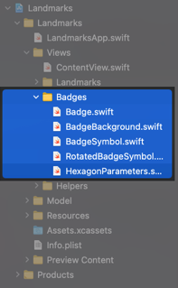

### Animating Views and Transitions

- Using the `animation(_:)` modifier, you'll animate a view that contains a graph for tracking the hikes a user takes while using the Landmarks app.
- [Project files](https://docs-assets.developer.apple.com/published/406233a99cd89616618a8e811d549348/AnimatingViewsAndTransitions.zip)

#### Add Hiking Data to the App

- You'll import and model hiking data, and then add some prebuilt views for displaying that data statically in a graph.

1. Drag the `hikeData.json` file from Project files' Resources folder into your project's Resources group.
   1. Be sure to select "Copy items if needed" before clicking Finish.
2. Create a new Swift file called Hike.swift in your project's Model group.

   1. Like the Landmark structure, the Hike structure conforms to Codable and has properties that match the keys in the corresponding data file.
   2. Declare `distanceText` to format distances with the unit by using `LengthFormatter`.

   - ```swift
      import Foundation

      struct Hike: Hashable, Codable {
          var id: Int
          var name: String
          var distance: Double
          var difficulty: Int
          var observations: [Observation]

          struct Observation: Hashable, Codable {
              var elevation: Range<Double>
              var pace: Range<Double>
              var heartRate: Range<Double>
              var distanceFromStart: Double
          }

          static var formatter = LengthFormatter()

          var distanceText: String {
              Hike.formatter.string(fromValue: distance, unit: .kilometer)
          }
      }
     ```

3. Load the hikes array into your model object, `ModelData.swift`.

   1. Because you'll never modify hike data after initially loading it, you don't need to mark it with the `@Published` attribute.

   - ```swift
      final class ModelData: ObservableObject {
          @Published var landmarks: [Landmark] = load("landmarkData.json")
          var hikes: [Hike] = load("hikeData.json")
      }
     ```

4. Drag the Hikes folder from the project files' Resources folder into your project's Views group.

   1. Be sure to select "Create groups" before clicking Finish.

   - 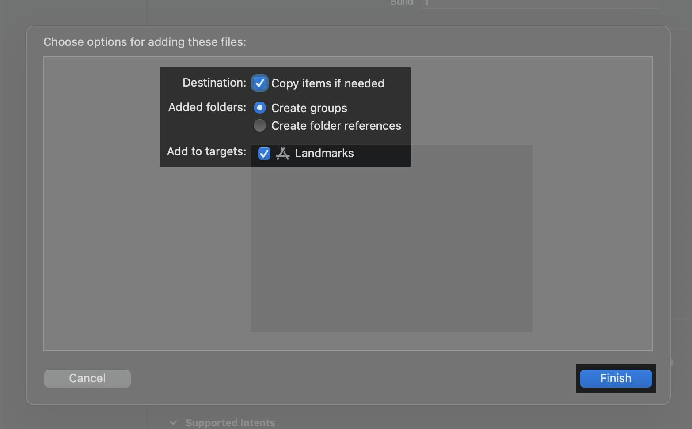

5. Familiarize yourself with the new views. They work together to display the hike data loaded into your model.

   1. In `HikeView.swift`, experiment with showing and hiding the graph.

   - <video src="https://user-images.githubusercontent.com/25374253/206953786-bb3dd7f5-f76d-4461-9ce1-2ad1eab452cd.mp4" controls="controls" style="max-width: 400px;"></video>

#### Add Animations to Individual Views

- 
- When you use the `animation(_:)` modifier on an equatable view, SwiftUI animates any changes to animatable properties of the view.
- A view's color, opacity, rotation, size, and other properties are all animatable.
- When the view isn't equatable, you can use the `animation(_:value:)` modifier to start animations when the specified value changes.

1. In HikeView.swift, turn on animation for the button's rotation by adding an animation modifier that begins on changes of the showDetail view.
   1. `.animation(.easeInOut, value: showDetail)`
2. Add another animatable change by making the button larger when the graph is visible.
   1. The animation modifier applies to all animatable changes within the views it wraps.
      1. `.scaleEffect(showDetail ? 1.5 : 1)`
3. Change the animation type from easeInOut to spring().
   1. SwiftUI includes basic animations with predefined or custom easing, as well as spring and fluid animations.
   2. You can adjust an animation's speed, set a delay before an animation starts, or specify that an animation repeats.
      1. `.animation(.spring(), value: showDetail)`
4. Try turning off animation for the rotation by adding another animation modifier just above the scaleEffect modifier.

   1. `.animation(nil, value: showDetail)`
   2. Take SwiftUI for a spin. Try combining different animation effects to see what's possible.
      1. basic: `.linear()`, `easeOut()`, `easeIn()`, `.easeInOut()`
         1. `.animation(.easeInOut(duration: 1).delay(1), value: showDetail)`
         2. `.animation(.easeInOut(duration: 2).repeatCount(3, autoreverses: true), value: showDetail)`
         3. .`animation(.easeInOut(duration: 2).repeatForever(autoreverses: true), value: showDetail)`
      2. `.spring()`
      3. `.interpolatingSpring(mass: 1, stiffness: 1, damping: 0.5, initialVelocity: 10)`
         1. mass: The mass of the object attached to the spring.
         2. initialVelocity: The initial velocity of the spring, as a value in the range [0,1] representing the magnitude of the value being animated.

   - ```swift
      Button {
          showDetail.toggle()
      } label: {
          Label("Graph", systemImage: "chevron.right.circle")
              .labelStyle(.iconOnly)
              .imageScale(.large)
              .rotationEffect(.degrees(showDetail ? 90 : 0))
              .animation(nil, value: showDetail)
              .scaleEffect(showDetail ? 1.5 : 1)
              .padding()
              .animation(.easeInOut(duration: 1).delay(0.3), value: showDetail)
      }
     ```

5. Remote both animation modifiers before moving on to the next section.

#### Animate the Effects of State Changes

- You'll apply animations to all of the changes that occur when a user taps a button and toggles the showDetail state property.

1. Wrap the call to showDetail.toggle() with a call to the withAnimation function.
   1. Both of the views affected by the showDetail property - the disclosure button and the HikeDetail view - now have animated transitions.
2. Slow down the animation to see how SwiftUI animations are interruptible.

   1. Pass a four-second long basic animation to the `withAnimation` function.
      1. You can pass the same kinds of animations to the `withAnimation` function that you passed to the `animation(_:value:)` modifier.
   2. Experiment with opening and closing the graph view mid-animation.

   - ```swift
      ...
      Button {
          withAnimation(.easeInOut(duration: 4)) {
              showDetail.toggle()
          }
          ...
     ```

3. Before continuing to the next section, restore the withAnimation function to use the default animation by removing the call's input parameter.

#### Customize View Transitions

- By default, views transition on- and offscreen by fading in and out.
- You can customize this transition by using the `transition(_:)` modifier.

1. Add a `transition(_:)` modifier to the conditionally visible HikeView.
   1. `if showDetail { HikeDetail(hike: hike).transition(.slide)}`
   2. Now the graph appears and disappears by sliding in and out of sight.
2. Extract the transition that you just added as a static property of AnyTransition, and access the new property in the view's transition modifier.

   1. This keeps your code clean as you expand the custom transition.

   - ```swift
      import SwiftUI

      extension AnyTransition {
          static var moveAndFade: AnyTransition {
              AnyTransition.slide
          }
      }
      ...
              VStack {
                  ...
                  if showDetail {
                      HikeDetail(hike: hike)
                          .transition(.moveAndFade)
                  }
      ...
     ```

3. Switch to using the `move(edge:)` transition, so that the graph slides in and out from the same side.
   - `AnyTransition.move(edge: .trailing)`
4. Use the `asymmetric(insertion:removal:)` modifier to provide different transitions for when the view appears and disappears.

   - ```swift
      ...
      static var moveAndFade: AnyTransition {
          .asymmetric(
              insertion: .move(edge: .trailing).combined(with: .opacity),
              removal: .scale.combined(with: .opacity)
          )
      }
      ...
     ```

- <video src="https://user-images.githubusercontent.com/25374253/207471507-233d81d7-c9e2-47f0-be64-f75798c8dfbe.mp4" controls="controls" style="max-width: 400px;"></video>

#### Compose Animations for Complex Effects

- The graph switches between three different sets of data when you click the buttons below the bars.
- You'll use a composed animation to give the capsules that make up the graph a dynamic, rippling transition.

1. In `HikeView`, change the default value for `showDetail` to `true`, and `pin` the preview to the canvas.
   1. `@State private var showDetail = true`
   2. This makes it possible for you to see the graph in context while you work on the animation in another file.
   - 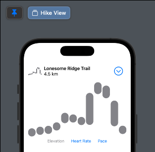
2. In `HikeGraph.swift`, define a new ripple animation and apply it to each generated graph capsule.

   - ```swift
      import SwiftUI

      extension Animation {
          static func ripple() -> Animation {
              Animation.default
          }
      }
      ...
                      ForEach(Array(data.enumerated()), id: \.offset) { index, observation in
                          GraphCapsule(
                              ...
                          )
                          .animation(.ripple())
                          ...
     ```

3. Switch the animation to a spring animation, with a reduced damping fraction to make the bars hop.
4. Speed up the animation a bit, to shorten the time each bar takes to move to its new position.
5. Add a delay to each animation that's based on the capsule's position on the graph.

   - ```swift
      ...
          static func ripple(index: Int) -> Animation {
              Animation.spring(dampingFraction: 0.5)
                  .speed(2)
                  .delay(0.03 * Double(index))
          }
      ...
                      ForEach(Array(data.enumerated()), id: \.offset) { index, observation in
                          GraphCapsule(
                              ...
                          )
                          .animation(.ripple(index: index))
                          ...
     ```

6. Observe how the custom animation provides a rippling effect when transitioning between graphs.
   1. Be sure to unpin the preview before moving on to the next tutorial.

## App Design and Layout

### Composing Complex Interfaces

- The category view for Landmarks shows a vertically scrolling list of horizontally scrolling landmarks.
- Ad you build this view and connect it to your existing views, you'll explore how composed views can adapt to different device sizes and orientations.
- [Project files](https://docs-assets.developer.apple.com/published/bd503d60b3bb9fa72a799637a1ecb6a2/ComposingComplexInterfaces.zip)

#### Add a Category View

- You can provide a different way to browse the landmarks by creating a view that sort landmarks by category,
- while highlighting a featured landmark at the top of the view.
- 

1. Create a `Categories` group in your project's Views group, and create a custom view called `CategoryHome` to the new group.
2. Add a `NavigationView` to host the different categories.
   1. You use navigation views along with NavigationLink instances and related modifiers to build hierarchical navigation structures in your app.
3. Set the title of the navigation bar to `Featured`.

   1. The view showcases one or more featured landmarks at the top.

   - ```swift
      import SwiftUI

      struct CategoryHome: View {
          var body: some View {
              NavigationView {
                  Text("Hello, World!")
                      .navigationTitle("Featured")
              }
          }
      }

      struct CategoryHome_Previews: PreviewProvider {
          static var previews: some View {
              CategoryHome()
          }
      }
     ```

#### Create a Category List

- The category view displays all categories in separate rows arranged in a vertical column for easier browsing.
- You do this by combining vertical and horizontal stacks, and adding scrolling to the list.
- Start by reading category data from the landmarkData.json file.

1. In `Landmark.swift`, add a Category enumeration and a category property to the Landmark structure.

   1. The landmarkData.json file already includes a category value for each landmark with one of three string values.
   2. By matching the names in the data file, you can rely on the structure's Codable conformance to load the data.

   - ```swift
      ...
          var category: Category
          enum Category: String, CaseIterable, Codable {
              case lakes = "Lakes"
              case rivers = "Rivers"
              case mountains = "Mountains"
          }
          ...
     ```

2. In `ModelData.swift`, add a computed categories dictionary, with category names as keys, and an array of associated landmarks for each key.

   - ```swift
      ...
          var categories: [String: [Landmark]] {
              Dictionary(
                  grouping: landmarks,
                  by: { $0.category.rawValue }
              )
          }
      ...
     ```

3. In `CategoryHome.swift`, create a modelData environment object.

   1. You'll need access to the categories right now, as well as to other landmark data later.
   2. Display the categories in Landmarks using a List.
      1. The Landmark.Category case name identifies each item in the list, which must be unique among other categories because it's an enumeration.

   - ```swift
      import SwiftUI

      struct CategoryHome: View {
          @EnvironmentObject var modelData: ModelData
          var body: some View {
              NavigationView {
                  List {
                      ForEach(modelData.categories.keys.sorted(), id: \.self) { key in
                          Text(key)
                      }
                  }
                  .navigationTitle("Featured")
              }
          }
      }

      struct CategoryHome_Previews: PreviewProvider {
          static var previews: some View {
              CategoryHome()
                  .environmentObject(ModelData())
          }
      }
     ```

- 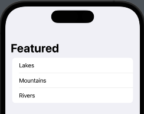

#### Create a Category Row

- Landmarks displays each category in a row that scrolls horizontally.
- Add a new view type to represent the row, then display all the landmarks for that category in the new view.
- 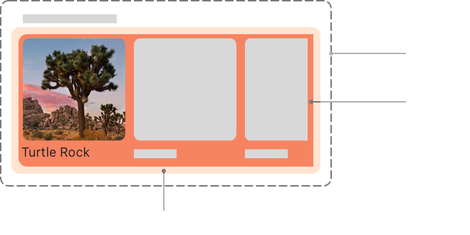

1. Define a new custom SwiftUI view CategoryRow in Categories Group for holding the contents of a row.
2. Add properties for the category name and the list of items in that category.
   1. `.prefix(_ maxLength: Int)` returns a subsequence, up to the specified maximum length, containing the initial elements of the collection.
3. Display the name of the category.
4. Put the category's items in an `HStack(alignment: .top, spacing: 0)`, and group that with the category name in a `VStack(alignment: .leading)`.
5. Adding padding to the category name, and wrapping the HStack in a `ScrollView(.horizontal, showsIndicators: false)`, give the content some space by specifying a tall `frame(height: 185)` to the ScrollView.

   - ```swift
      import SwiftUI

      struct CategoryRow: View {
          var categoryName: String
          var items: [Landmark]
          var body: some View {
              VStack(alignment: .leading) {
                  Text(categoryName)
                      .font(.headline)
                      .padding(.leading, 15)
                      .padding(.top, 5)
                  ScrollView(.horizontal, showsIndicators: false) {
                      HStack(alignment: .top, spacing: 0) {
                          ForEach(items) { landmark in
                              Text(landmark.name)
                          }
                      }
                  }
                  .frame(height: 185)
              }
          }
      }

      struct CategoryRow_Previews: PreviewProvider {
          static var landmarks = ModelData().landmarks
          static var previews: some View {
              CategoryRow(
                  categoryName: landmarks[0].category.rawValue,
                  items: Array(landmarks.prefix(4))
              )
          }
      }
     ```

6. Create a new custom SwiftUI view called CategoryItem that displays one landmark.

   - ```swift
      import SwiftUI

      struct CategoryItem: View {
          var landmark: Landmark
          var body: some View {
              VStack(alignment: .leading) {
                  landmark.image
                      .resizable()
                      .frame(width: 155, height: 155)
                      .cornerRadius(5)
                  Text(landmark.name)
                      .font(.caption)
              }
              .padding(.leading, 15)
          }
      }

      struct CategoryItem_Previews: PreviewProvider {
          static var previews: some View {
              CategoryItem(landmark: ModelData().landmarks[0])
          }
      }
     ```

7. In `CategoryRow.swift`, replace the Text that holds the landmark name with the new CategoryItem view.

   - ```swift
      ...
          ForEach(items) { landmark in
              CategoryItem(landmark: landmark)
          }
      ...
     ```

- 

#### Complete the Category View

- Add the rows and the featured image to the cateogry home page.
- <video src="https://user-images.githubusercontent.com/25374253/208339716-263f45ac-0734-4d25-8abe-f0a4c06605e7.mp4" controls="controls" style="max-width: 400px;"></video>

1. Update the body of `CategoryHome.swift` to pass category information to instance of the row type.

   - ```swift
      ...
                ForEach(modelData.categories.keys.sorted(), id: \.self) { key in
                    CategoryRow(categoryName: key, items: modelData.categories[key]!)
                }
      ...
     ```

2. You'll add a featured landmark to the top of the view.
3. You'll need more information from the landmark data to do this.
   1. In `Landmark.swift`, add a new isFeatured property.
      1. Like for other landmark properties you've added, this Boolean already exists in the data - you just need to declare a new property.
      2. `var isFeatured: Bool`
   2. In `ModelData.swift`, add a new computed features array, which contains only the landmarks that have isFeatured set to true.
      1. `var features: [Landmark] { landmarks.filter { $0.isFeatured } }`
4. In `CategoryHome.swift`, add the image of the first featured landmark to the top of the list.

   1. You'll turn this view into an interactive carousel in a later tutorial.
   2. For now, it displays one of the featured landmarks with a scaled and cropped preview image.

      - ```swift
          ...
              NavigationView {
                  List {
                      modelData.features[0].image
                          .resizable()
                          .scaledToFill()
                          .frame(height:200)
                          .clipped()
                      ...
        ```

5. Set the edge insets to zero on both kinds of landmark previews so the content can extend to the edges of the display.
   1. Add `.listRowInsets(EdgeInsets())` to the featured image and the categories.

- 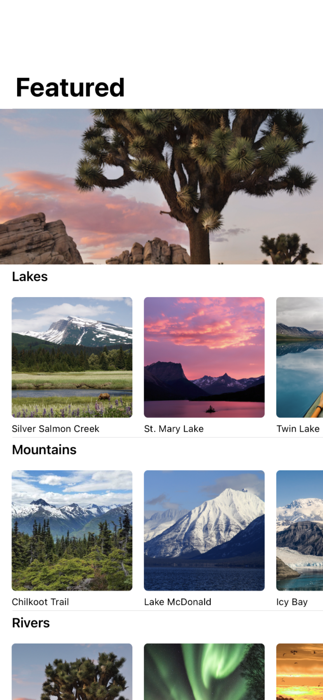

#### Add Navigation Between Sections

- With all of the differently categorized landmarks visible in the view, the user needs a way to reach each section in the app.
- Use the navigation and presentation APIs to make the category home, the detail view, and favorites list navigable from a tab view.

1. In `CategoryRow.swift`, wrap the existing `CategoryItem` with a `NavigationLink`.

   1. The category item itself is the label for the button, and its destination is the landmark detail view for the landmark represented by the card.

   - ```swift
      ...
                    ForEach(items) { landmark in
                        NavigationLink {
                            LandmarkDetail(landmark: landmark)
                        } label: {
                            CategoryItem(landmark: landmark)
                        }
                    }
                ...
     ```

2. Pin the preview so you can see the effect of the next step on the CategoryRow.
3. Change the navigation appearance of the `categoryItem` by applying the `renderingMode(_:)` and `foregroundColor(_:)` modifiers.

   1. Text that you pass as the label for a navigation link renders using the environment's accent color, and images may render as template images.
   2. You can modify either behavior to best suit your design.

   - ```swift
      ...
            landmark.image
                .renderingMode(.original)
                ...
            Text(landmark.name)
                .foregroundColor(.primary)
                ...
     ```

4. Let the user choose between the category view you just created, and the existing list of landmarks.

   1. Unpin the preview, switch to the `ContentView` and add an enumeration of the tabs to display.
   2. Add a state variable for the tab selection, and give it a default value.
   3. Create a `TabView` that wraps the `LandmarkList`, as well as the new `CategoryHome`.
      1. The `tag(_:)` modifier on each of the views matches one of the possible values that the selection property can take
      2. so the TabView can coordinate which view to display when the user makes a selection in the user interface.
   4. Give each tab a label with `.tabItem{Label(_ titleKey:, systemImage:)}`.

   - ```swift
      import SwiftUI

      struct ContentView: View {
          @State private var selection: Tab = .featured
          enum Tab {
              case featured
              case list
          }
          var body: some View {
              TabView(selection: $selection) {
                  CategoryHome()
                      .tabItem{
                          Label("Featured", systemImage: "star")
                      }
                      .tag(Tab.featured)
                  LandmarkList()
                      .tabItem {
                          Label("List", systemImage: "list.bullet")
                      }
                      .tag(Tab.list)
              }
      //        LandmarkList()
          }
      }

      struct ContentView_Previews: PreviewProvider {
          static var previews: some View {
              ContentView().environmentObject(ModelData())
          }
      }
     ```

- <video src="https://user-images.githubusercontent.com/25374253/208588333-eda20f13-bd72-4fd2-b08a-202fe6929a23.mp4" controls="controls" style="max-width: 400px;"></video>

### Working with UI Controls

- In the Lanmarks app, users can create a profile to express their personality.
- To give users the ability to change their profile, you'll add an edit mode and design the preferences screen.
- You'll work with a cariety of common user interface controls for data entry,
- and update the Landmarks model types whenever the user saves their changes.
- [Project files](https://docs-assets.developer.apple.com/published/e277ce6bcbe9025478a3486cfa68746a/WorkingWithUIControls.zip)

#### Display a User Profile

- The Landmarks app locally stores some configuration details and preferences.
- Before the uer edits their details, they're displayed in a summary view that doesn't have any editing controls.

1. Start by defining a user profile in a new Swift file named `Profile.swift` that you add to your project's Model group.

   - ```swift
      import Foundation

      struct Profile {
          var username: String
          var prefersNotifications = true
          var seasonlPhoto = Season.winter
          var goalDate = Date()

          static let `default` = Profile(username: "g_kumar")

          enum Season: String, CaseIterable, Identifiable {
              case spring = "🌷"
              case summer = "🌞"
              case autumn = "🍁"
              case winter = "☃️"

              var id: String { rawValue }
          }
      }
     ```

2. Create a new group named `Profiles` under the Views group,
3. and then add a view named `ProfileHost` to that group with a text view that displays the username of a stored profile.

   1. The `ProfileHost` view will host both a static, summary view of profile information and an edit mode.

   - ```swift
      import SwiftUI

      struct ProfileHost: View {
          @State private var draftProfile = Profile.default
          var body: some View {
              Text("Profile for: \(draftProfile.username)")
          }
      }

      struct ProfileHost_Previews: PreviewProvider {
          static var previews: some View {
              ProfileHost()
          }
      }
     ```

4. Create another view in the `Profiles` group named `ProfileSummary` that takes a `Profile` instance and displays some basic user information.

   1. The profile summary takes a Profile value rather than a binding to the profile because the parent view, ProfileHost, manages the state for this view.

   - ```swift
      import SwiftUI

      struct ProfileSummary: View {
          var profile: Profile

          var body: some View {
              ScrollView {
                  VStack(alignment: .leading, spacing: 10) {
                      Text(profile.username)
                          .bold()
                          .font(.title)

                      Text("Notifications: \(profile.prefersNotifications ? "On" : "Off")")
                      Text("Seasonal Photos: \(profile.seasonlPhoto.rawValue)")
                      Text("Goal Date: ") + Text(profile.goalDate, style: .date)
                  }
              }
          }
      }

      struct ProfileSummary_Previews: PreviewProvider {
          static var previews: some View {
              ProfileSummary(profile: Profile.default)
          }
      }
     ```

5. Update `ProfileHost` to display the new summary view.

   - ```swift
      ...
          var body: some View {
              VStack(alignment: .leading, spacing: 20) {
                  ProfileSummary(profile: draftProfile)
              }
              .padding()
          }
          ...
     ```

6. Create a new view named `HikeBadge` in the `Hikes` folder that composes the Badge
7. from Drawing Paths and Shapes along with some descriptive text about the hike.

   1. The badge is just a graphic, so the text in `HikeBadge` along with the `accessibilityLabel(_:)` modifier
   2. make the meaning of the badge clearer to other users.
   3. Note:
      1. The badge's drawing logic produces a result that depends on the size of the frame in which it renders.
      2. To ensure the desired appearance, render in a **frame of 300 x 300** points.
      3. To get the desired size for the final graphic, then **scale** the rendered result and place it in a comparably **smaller frame**.
      4. Declare name variable for the text.

   - ```swift
      import SwiftUI

      struct HikeBadge: View {
          var name: String
          var body: some View {
              VStack(alignment: .center) {
                  Badge()
                      .frame(width: 300, height: 300)
                      .scaleEffect(1.0 / 3.0)
                      .frame(width: 100, height: 100)
                  Text(name)
                      .font(.caption)
                      .accessibilityLabel("Badge for \(name).")
              }
          }
      }

      struct HikeBadge_Previews: PreviewProvider {
          static var previews: some View {
              HikeBadge(name: "Preview Testing")
          }
      }
     ```

8. Update ProfileSummary to add several badges with varying hues and reasons for earning the badge.

   - ```swift
      ...
        var body: some View {
            ScrollView {
                ...
                    Divider()

                    VStack(alignment: .leading) {
                        Text("Completed Badge")
                            .font(.headline)
                        ScrollView(.horizontal) {
                            HStack {
                                HikeBadge(name: "First Hike")
                                HikeBadge(name: "Earth Dau")
                                    .hueRotation(Angle(degrees: 90))
                                HikeBadge(name: "Tenth Hike")
                                    .hueRotation(Angle(degrees: 45))
                            }
                            .padding(.bottom)
                        ...
     ```

9. Finish off the profile summary by including a HikeView from Animating Views and Transitions.

   1. To use the hike data, you also need to add a model data environment object.

   - ```swift
      struct ProfileSummary: View {
          @EnvironmentObject var modelData: ModelData
          ...
              ScrollView {
                  ...
                      Divider()
                      VStack(alignment: .leading) {
                          Text("Recent Hikes")
                              .font(.headline)
                          HikeView(hike: modelData.hikes[0])
                      }
                  }
              }
          }
      }


      struct ProfileSummary_Previews: PreviewProvider {
          static var previews: some View {
              ProfileSummary(profile: Profile.default)
                  .environmentObject(ModelData())
          }
      }
     ```

10. In `CategoryHome.swift`,

    1. add a user profile button to the navigation bar using the `toolbar` modifier,
    2. and present the `profileHost` view using the `sheet(isPresented:)` modifier when the user taps it.
    3. Add the `listStyle` modifier to pick a list style that better suits the content.

    - ```swift
        struct CategoryHome: View {
            @EnvironmentObject var modelData: ModelData
            @State private var showingProfile = false
            var body: some View {
                NavigationView {
                    List {
                        ...
                    }
                    .listStyle(.inset)
                    .navigationTitle("Featured")
                    .toolbar {
                        Button {
                            showingProfile.toggle()
                        } label: {
                            Label("User Profile", systemImage: "person.crop.circle")
                        }
                    }
                    .sheet(isPresented: $showingProfile) {
                        ProfileHost()
                            .environmentObject(modelData)
                    }
                ...
      ```
