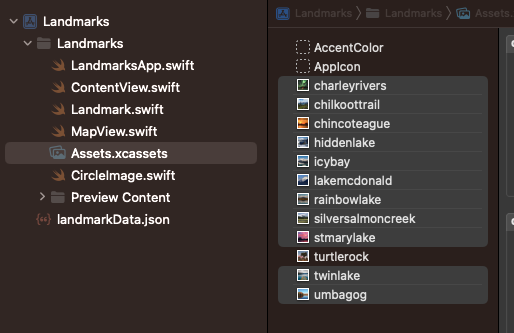
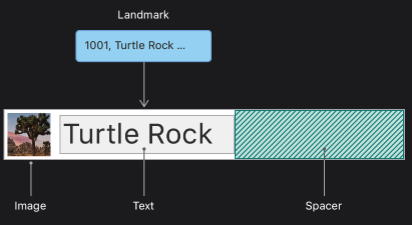
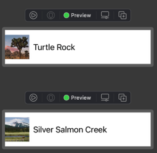

# Introducing SwiftUI

## SwiftUI Essentials

- Learn how to use SwiftUI to compose rich views out of simple ones, set up data flow, and build the navigation while watching it unfold in Xcode's preview.

### Creating and Combining Views

- This tutorial guides you through building Landmarks - an app for discovering and sharing the places you love.
- You'll start by building the view that shows a landmark's details.
- To lay out the views, Landkmarks uses `VStack` and `HStack` to combine and layer the image and text view components.
- To add a map to the view, you 'll include a standard `MapKit` component.

- [Project files](https://docs-assets.developer.apple.com/published/9637262be4dfa3661d596e567d0c793f/CreatingAndCombiningViews.zip)

#### Create a New Project and Explore the Canvas

1. Open Xcode and either click "Create a new Xcode project" in Xcode's startup window, or choose File > New > Project.
2. In the template selector, select iOS as the platform, select the App template, and then click Next.
3. Enter "Landmarks" as the product name, select "SwiftUI" for the interface and "Swift" for the language, and click Next. Choose a location to save the project on your Mac.
4. In the Project navigator, select LandmarksApp.swift.
   1. An app that uses the SwiftUI app life cycle has a structure that conforms to the App protocol.
   2. The Structure's body property returns one or more scenes, which in turn provide content for display.
   3. The @main attribute identifies the app's entry point.
5. In the Project navigator, select ContentView.swift.
   1. By default, SwiftUI view files declare two structures.
   2. The first structure conforms to the View protocol and describes the view's content and layout.
   3. The second structure declares a preview for that view.
6. In the canvas, click Resume to display the preview.
   1. If the canvas isn't visible, select Editor > Canvas to show it.
7. Inside the body property, change "Hello, World!" to a greeting for yourself.
   1. As you change the code in a view's body property, the preview updates to reflect your changes.

#### Customize the Text View

1. Customize the text view using the inspector.
   1. In the preview, Command-click the greeting to bring up the structured editing popover, and choose "Show SwiftUI Inspector".
      1. The popover shows different attributes that you can customize, depending on the type of view you inspect.
      2. If it's not clickable, active Selectable on the left bottom
      - 
   2. Use the inspector to change the text to "Turtle Rock", the name of the first landmark you'll show in your app.
   3. Change the Font modifier to "Title".
      1. This applies the system font to the text so that it responds correctly to the user's preferred font sizes and settings.
      - 
2. To customize a SwiftUI view, you call methods called modifiers. Modifiers wrap a view to change its display or other properties. Each modifier returns a new view, so it's common to chain multiple modifiers, stacked vertically.
   1. Edit the code by hand to change the padding() modifier to the foreground Color(.green) modifier; this changes the text's color to green.
   - `Text("Turtle Rock").font(.title).foregroundColor(Color.green)`
3. Your code is always the source of truth for the view. When you use the inspector to change or remove a modifier, Xcode updates your code immediately to match.
   1. Open the inspector by Command-clicking on the Text declaration in the code editor, and then choose "Show SwiftUI Inspector" from the popover. Click the color pop-up menu and choose Inherited to change the text color to black again.
   2. Notice that Xcode updates your code automatically to reflect the change, removing the forgroundColor(.green) modifier.
   - 

#### Combine Views Using Stacks

1. You can use Xcode's structured editing support to embed a view in a container view, open an inspector, or help with other useful changes.
   1. Command-click the text view's initializer to show the structured editing popover, and then choose "Embed in VStack".
      1. 
2. Next, you'll add a text view to the stack by dragging a Text view from the library.
   1. Open the library by clicking the plus button (+) at the top-right of the Xcode window, and then drag a Text view to the place in your code immediately below the "Turtle Rock" text view.
   2. Replace the Text view's placeholder text with "Joshua Tree National Park".
3. Customize the location to match the desired layout.
   1. Set the location's font to subheadline.
      1. `.font(.subheadline)`
   2. Edit the VStack initializer to align the views by their leading edges.
      1. By default, stack center their contents alogn their axis and provide context-appropriate spacing.
      2. `VStack(alignment: .leading) {`
4. Next, you'll add another text view to the right of the location, this for the park's state.

   1. In the canvas, Command-click "Joshua Tree National Park", and choose "Embed in HStack".
      1. 
   2. Add a new text view after the location, change the placeholder text to "California", the park's state, and then set its font to subheadline.
      1. `Text("California").font(.subheadline)`
   3. To direct the layout to use the full width of the device, separate the park and the state by adding a `Spacer()` to the horizontal stack holding the two text views.
      1. A spacer expands to make its containing view use all of the space of its parent view, instead of having its size defined only by its contents.
   4. Finally, use the `padding()` modifier method to give the landmark's name and details a little more space.

   - ```swift
      struct ContentView: View {
          var body: some View {
              VStack {
                  VStack(alignment: .leading) {
                      Text("Turtle Rock")
                          .font(.title)
                          .foregroundColor(Color.black)
                      HStack {
                          Text("Joshua Tree National Park")
                              .font(.subheadline)
                          Spacer()
                          Text("California")
                              .font(.subheadline)
                      }
                  }
              }
              .padding()
          }
      }
     ```

   - 

#### Create a Custom Image View

1. Start by adding an image to the project's asset catalog.
   1. Find turtlerock@2x.jpg in the project files' Resources folder; drag it into the asset catalog's editor. Xcode creates a new image set for the image.
   2. 
2. Next, you'll create a new SwiftUI view for your custom image view.
   1. Choose File > New > File to open the template selector again.
   2. In the User Interface section, select "SwiftUI View" and click Next. Name the file CircleImage.swift and click Create.
3. You're ready to insert the image and modify its display to match the desired design.

   1. Replace the: text view with the image of Turtle Rock by using the `Image(_:)` initializer, passing it the name of the image to display.
      1. You can check the name in the asset catalog's editor.
   2. Add a call to `clipShape(Circle())` to apply the circular clipping shape to the image.
      1. The Circle type is a shape that you can use as a mask, or as a view by giving the circle a stroke of fill.
      2. The shapes of `.clipShape()`:
         1. `Circle()`
         2. `Ellipse()`
         3. `Capsule()`
         4. `RoundedRectangle(cornerRadius: 25.0)`
         5. `Rectangle()`
   3. Create another circle with a gray stroke, and then add it as an overlay to give the image a border.
      1. `.overlay { Circle().stroke(.gray, lineWidth: 4) }`
   4. Next, add a shadow with a 7 point radius.
      1. `.shadow(radius:7)`
   5. Switch the border color to white.

   - ```swift
      import SwiftUI

      struct CircleImage: View {
          var body: some View {
              Image("turtlerock")
                  .clipShape(Circle())
                  .overlay {
                      Circle().stroke(.white, lineWidth: 4)
                  }
                  .shadow(radius: 7)
          }
      }

      struct CircleImage_Previews: PreviewProvider {
          static var previews: some View {
              CircleImage()
          }
      }
     ```

   - 

#### Use SwiftUI Views From Other Frameworks

- You'll create a map that centers on a given coordinate. You can use the Map view from MapKit to render the map.

1. To get started, you'll create a new custom view to manage your map.

   1. Choose File > New > File, select iOS as the platform, select the "SwiftUI View" template, and click Next.
      1. Name the new file MapView.swift and click Create.
   2. Add an import statement for MapKit, `import MapKit`.
      1. When you import SwiftUI and certain other frameworks in the same file, you gain access to SwiftUI-specific functionality provided by that framework.
   3. Create a private state variable that holds the region information for the map.

      1. You use the @State attribute to establish a source of truth for data in your app that you can modify from more than one view.
      2. SwiftUI manages the underlying storage and automatically updates views that depend on the value.

      - ```swift
          @State private var region = MKCoordinateRegion(
              center: CLLocationCoordinate2D(latitude: 34.011_286, longitude: -116.166_868),
              span: MKCoordinateSpan(latitudeDelta: 0.2, longitudeDelta: 0.2)
          )
        ```

   4. Replace the default Text view with a Map view that takes a binding to the region.
      1. By prefixing a state variable with $, you pass a binding, which is like a reference to the underlying value.
      2. When the user interacts with the map, the map updates the region value to match the part of the map that's currently visible in the user interface.

2. When previews are in static mode, they only fully render native SwiftUI views. For the Map view, you'll need to switch to a live preview to see it render.

   1. Click Live Preview to switch the preview to live mode. You might need to click Try Again or Resume above your preview.
      1. In a moment, you'll see a map centered on Turtle Rock.
      2. You can manipulate the map in live preview to zoom out a bit and see the surrounding area.

   - ```swift
       import SwiftUI
       import MapKit

       struct MapView: View {
           @State private var region = MKCoordinateRegion(
               center: CLLocationCoordinate2D(latitude:34.011, longitude: -116.166),
               span: MKCoordinateSpan(latitudeDelta: 0.2, longitudeDelta: 0.2)
           )
           var body: some View {
               Map(coordinateRegion: $region)
           }
       }

       struct MapView_Previews: PreviewProvider {
           static var previews: some View {
               MapView()
           }
       }
     ```

#### Compose the Detail View

- You new have all of the components you need - the name and place, a circular image, and a map for the location.
- With the tools you've used so far, combine your custom views to create the final design for the landmark detail view.
- 

1. In the Project navigator, select the ContentView.swift file
2. Embed the VStack that holds the three text views in another VStack.
3. Add your custom MapView tot he top of the stack. Set the size of the Map View with `.frame(height:300)`.
4. Click Live Preview to see the rendered map in the composed view.
   1. You can continue editing the view while showing a Live Preview.
5. Add the CircleImage view to the stack.
6. To layer the image view on top of the map view, give the image an offset of -130 points vertically, `.offset(y:-130)`, and padding of -130 points from the bottom of the view, `.padding(.bottom, -130)`.
   1. These adjustments make room for the text by moving the image upwards.
7. Add a `Spacer()` at the bottom of the outer VStack to push the content to the top of the screen.
8. To allow the map content to extend to the top edge of the screen, add the `.ignoresSafeArea(edges: .top)` modifier to the map view.
   1. The modifier needs to put right after `MapView()`, so before `.frame()`.
      1. The height of map increases as much as the safe area.
   2. If the modifier locates after `.frame()`, the map will go up.
      1. The height of map keeps 300.
9. Add a `Divider()` and some additional descriptive text for the landmark.
10. Finally, move the subheadline font modifier from each Text view to the HStack containing them, and apply the secondary color to the subheadline text.
    1. When you apply a modifier to a layout view like a stack, SwiftUI applies the modifier to all the elements contained in the group.

- ContentView.swift

  - ```swift
      import SwiftUI

      struct ContentView: View {
          var body: some View {
              VStack {
                  MapView()
                      .ignoresSafeArea(edges: .top)
                      .frame(height:300)

                  CircleImage()
                      .offset(y:-130)
                      .padding(.bottom, -130)

                  VStack(alignment: .leading) {
                      Text("Turtle Rock")
                          .font(.title)
                          .foregroundColor(Color.black)
                      HStack {
                          Text("Joshua Tree National Park")
                          Spacer()
                          Text("California")
                      }
                      .font(.subheadline)
                      .foregroundColor(.secondary)

                      Divider()

                      Text("About Turtle Rock")
                          .font(.title2)
                      Text("Descriptive text goes here.")

                  }
                  .padding()

                  Spacer()
              }
          }
      }

      struct ContentView_Previews: PreviewProvider {
          static var previews: some View {
              ContentView()
          }
      }
    ```

---

### Building Lists and Navigation

- You'll create views that can show information about any landmark,
- and dynamically generate a scrolling list that a user can tap to see a detail view for a landmark.

- [Project files](https://docs-assets.developer.apple.com/published/58c23eda8649a103c25ce8f2b8d7547a/BuildingListsAndNavigation.zip)

#### Create a Landmark Model

- You'll create a model to store data that you can pass into your view.

1. Drag landmarkData.json in the downloaded files' Resources folder into your project's navigation pane;
   1. in the dialog that appears, select "Copy items if needed" and the Landmarks target, and then click Finish.
   2. You will use this sample data throughout the remainder of this tutorial, and for all that follow.
2. Choose File > New > File to create a new `Swift file` in your project, and name it Landmark.swift.
3. Define a Landmark structure with a few properties matching names of some of the keys in the landmarkData.json data file.

   - ```json
     [
       {
         "name": "Turtle Rock",
         "category": "Rivers",
         "city": "Twentynine Palms",
         "state": "California",
         "id": 1001,
         "isFeatured": true,
         "isFavorite": true,
         "park": "Joshua Tree National Park",
         "coordinates": {
           "longitude": -116.166868,
           "latitude": 34.011286
         },
         "description": "Suscipit inceptos est ...",
         "imageName": "turtlerock"
       },
       {
         "": ""
       }
     ]
     ```

   1. Adding Codable conformance makes it easier to move data between the structure and a data file.
   2. You'll reply on the Decodable component of the Codable protocol later in this section to read data from file.

   - ```swift
      import Foundation

      struct Landmark: Hashable, Codable {
          var id: Int
          var name: String
          var park: String
          var state: String
          var description: String
      }
     ```

4. Model the image associated with each landmark.
   1. Drag the JPG files from the downloaded files' Resources folder into your project's asset catalog.
      1. Xcode creates a new image set for each image.
      2. 
5. Add an `imageName` property to read the name of the image from the data, and a computed image property that loads an image from the asset catalog.

   1. You make the property `private` because users of the Landmarks structure care only about the image itself.

      - ```swift
          ...
          import SwiftUI

          struct Landmark: Hashable, Codable {
              ...

              private var imageName: String
              var image: Image {
                  Image(imageName)
              }
          }
        ```

6. Manage information about the landmark's location.

   1. Add a `coordinates` property to the structure using a `nested Coordinates type` that reflects the storage in the JSON data structure.

      1. You mark this property as `private` because you'll use it only to create a public computed property in the next step.

         - ```swift
             ...
             struct Landmark: Hashable, Codable {
                 ...

                 struct Coordinates: Hashable, Codable {
                     var latitude: Double
                     var longitude: Double
                 }
                 private var coordinates: Coordinates
             }
           ```

7. Compute a `locationCoordinate` property that's useful for interacting with the MapKit framework.

   - ```swift
       ...
       import CoreLocation

       struct Landmark: Hashable, Codable {
           ...
           var locationCoordinate: CLLocationCoordinate2D {
               CLLocationCoordinate2D(
                   latitude: coordinates.latitude,
                   longitude: coordinates.longitude
               )
           }
       }
     ```

8. Create an array initialized with landmarks from a file.

   1. Create a new `Swift file` in your project and name it ModelData.swift
   2. Create a `load(_:)` method that fetches JSON data with a given name from the app's main bundle.

      1. The load method relies on the return type's conformance to the Decodable protocol, which is one component of the Codable protocol.

      - ```swift
          import Foundation

          func load<T: Decodable>(_ filename: String) -> T {
              let data: Data

              guard let file = Bundle.main.url(forResource: filename, withExtension: nil) else {
                  fatalError("Couldn't find \(filename) in main bundle.")
              }

              do {
                  data = try Data(contentsOf: file)
              } catch {
                  fatalError("Couldn't load \(filename) from main bundle:\n\(error)")
              }

              do {
                  let decoder = JSONDecoder()
                  return try decoder.decode(T.self, from: data)
              } catch {
                  fatalError("Couldn't parse \(filename) as \(T.self):\n\(error)")
              }
          }
        ```

   3. Create an array of landmarks that you initialize from landmarkData.json

      - ```swift
          import Foundation

          var landmarks: [Landmark] = load("landmarkData.json")
          ...
        ```

9. Group related files together to make it easier to manage your growing project.

   1. Put ContentView.swift, CircleImage.swift, and MapView.swift into a Views group,
   2. landmarkData.json in a Resources group,
   3. and Landmark.swift and ModelData.swift into a Model group.
      1. You can create groups of existing items by selecting the items to add to the group,
      2. and then choosing File > New > Group from Selection in the Xcode menu.

   -

#### Create the Row View

- This row view stores information in a property for the landmark it displays, so that one view can display any landmark.
- Later, you'll combine multiple rows into a list of landmarks.
- 

1. Create a new SwiftUI view in the Views group named LandmarkRow.swift.
2. Add landmark as a stored property of LandmarkRow.

   1. When you add the landmark property, the preview stops working, because the LandmarkRow type needs a landmark instance during initialization.

   - ```swift
     struct LandmarkRow: View {
       var landmark: Landmark
       ...
     }
     ```

3. To fix the preview, you'll need to modify the preview provider.

   1. In the preview static property of LandmarkRow_Previews,
   2. add the landmark parameter to the LandmarkRow initializer,
   3. specifying the first element of the landmark array.

   - ```swift
      ...
      struct LandmarkRow_Previews: PreviewProvider {
          static var previews: some View {
              LandmarkRow(landmark: landmark[0])
          }
      }
     ```

4. With the fixed, you can build the layout for the row.
   1. Embed the existing text view in an HStack.
   2. Modify the text view to use the landmark property's name.
   3. Complete the row by adding an image before the text view, and a spacer after it.

- ```swift
  import SwiftUI

  struct LandmarkRow: View {
      var landmark: Landmark
      var body: some View {
          HStack {
              landmark.image
                  .resizable()
                  .frame(width: 50, height: 50)
              Text(landmark.name)
              Spacer()
          }
      }
  }

  struct LandmarkRow_Previews: PreviewProvider {
      static var previews: some View {
          LandmarkRow(landmark: landmark[0])
      }
  }
  ```

#### Customize the Row Preview

- A preview provider returns one or more views, with options to configure the size and device.

1. In LandmarkRow_Previews, update the landmark parameter to be the second element in the landmark array, `landmark[1]`.
   1. The preview immediately changes to show the second sample landmark instead of the first.
2. Use the previewLayout(\_:) modifier to set a size that approximates a row in a list.
3. You can use a Group to return multiple previews from a preview provider.

   1. Wrap the returned row in a Group, and add the first row back again.

      1. Group is a container for grouping view content. Xcode renders the group's child views as separate previews in the canvas.

      - ```swift
            struct LandmarkRow_Previews: PreviewProvider {
                static var previews: some View {
                    Group {
                        LandmarkRow(landmark: landmark[0])
                            .previewLayout(.fixed(width: 300, height: 70))
                        LandmarkRow(landmark: landmark[1])
                            .previewLayout(.fixed(width: 300, height: 70))
                    }
                }
            }
        ```

      - 

   2. To simplify the code, move the preview Layout(\_:) call to the outside of the group's child declarations.

      1. A view's children inherit the view's contextual settings, such as preview configurations.

      - ```swift
            struct LandmarkRow_Previews: PreviewProvider {
                static var previews: some View {
                    Group {
                        LandmarkRow(landmark: landmark[0])
                        LandmarkRow(landmark: landmark[1])
                    }
                    .previewLayout(.fixed(width: 300, height: 70))
                }
            }
        ```

4. The code you write in a preview provider only changes what Xcode displays in the canvas.
